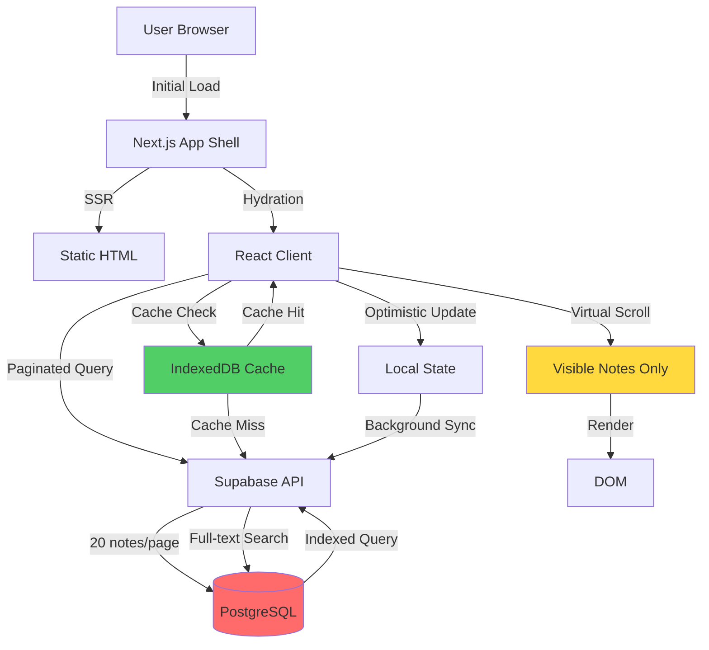

# System Design: Performance Optimization for Large Datasets

## Architecture Overview
**What is the high-level system structure?**



### Key Components

**1. Data Fetching Layer**
- Pagination with cursor-based navigation
- Prefetching next page on scroll
- Incremental loading strategy

**2. Caching Layer**
- IndexedDB for persistent cache
- Memory cache for active notes
- Cache invalidation strategy

**3. Rendering Layer**
- Virtual scrolling (react-window)
- Lazy loading of note content
- Progressive image loading

**4. State Management**
- Optimistic updates for instant feedback
- Background synchronization
- Conflict resolution

### Technology Stack

| Component | Technology | Rationale |
|-----------|-----------|-----------|
| Virtual Scrolling | react-window | Lightweight, proven, 60 FPS |
| Caching | IndexedDB (idb) | Large storage, persistent |
| Pagination | Supabase Range | Built-in, efficient |
| Search | Supabase FTS | Server-side, scalable |
| State | React Query | Caching, deduplication |
| Optimization | React.memo | Prevent re-renders |

## Data Models
**What data do we need to manage?**

### Note List Item (Lightweight)
```typescript
interface NoteListItem {
  id: string
  title: string
  description: string | null // First 200 chars only
  tags: string[]
  created_at: string
  updated_at: string
  // NO full content in list view
}
```

### Full Note (On Demand)
```typescript
interface FullNote extends NoteListItem {
  description: string // Full content
  user_id: string
}
```

### Cache Entry
```typescript
interface CacheEntry {
  key: string // 'notes-page-1', 'note-123', etc.
  data: any
  timestamp: number
  expiresAt: number
}
```

### Pagination State
```typescript
interface PaginationState {
  currentPage: number
  pageSize: number
  totalCount: number
  hasMore: boolean
  cursor: string | null // For cursor-based pagination
}
```

## API Design
**How do components communicate?**

### Supabase Queries

**1. Paginated Notes List**
```typescript
// Fetch notes with range
const { data, error, count } = await supabase
  .from('notes')
  .select('id, title, description, tags, created_at, updated_at', { count: 'exact' })
  .order('updated_at', { ascending: false })
  .range(start, end)
  .limit(20)

// Use substring for description preview
.select('id, title, description::text, tags, created_at, updated_at')
// Note: PostgreSQL substring in query
```

**2. Single Note (Full Content)**
```typescript
const { data, error } = await supabase
  .from('notes')
  .select('*')
  .eq('id', noteId)
  .single()
```

**3. Full-Text Search**
```typescript
const { data, error } = await supabase
  .from('notes')
  .select('id, title, description, tags, created_at, updated_at')
  .textSearch('title,description', searchQuery, {
    type: 'websearch',
    config: 'english'
  })
  .range(0, 19)
```

**4. Tag Filter**
```typescript
const { data, error } = await supabase
  .from('notes')
  .select('id, title, description, tags, created_at, updated_at')
  .contains('tags', [selectedTag])
  .order('updated_at', { ascending: false })
  .range(0, 19)
```

### Database Indexes Needed

```sql
-- Index for updated_at sorting (most common query)
CREATE INDEX IF NOT EXISTS idx_notes_updated_at 
ON notes(user_id, updated_at DESC);

-- Index for full-text search
CREATE INDEX IF NOT EXISTS idx_notes_fts 
ON notes USING GIN (to_tsvector('english', title || ' ' || description));

-- Index for tag filtering
CREATE INDEX IF NOT EXISTS idx_notes_tags 
ON notes USING GIN (tags);

-- Composite index for user + updated_at
CREATE INDEX IF NOT EXISTS idx_notes_user_updated 
ON notes(user_id, updated_at DESC) 
WHERE user_id IS NOT NULL;
```

## Component Breakdown
**What are the major building blocks?**

### 1. NotesList Component (Refactored)
**File:** `components/NotesList.jsx` (new)

**Responsibilities:**
- Virtual scrolling with react-window
- Infinite scroll loading
- Skeleton loaders
- Empty states

**Key Features:**
```jsx
<FixedSizeList
  height={600}
  itemCount={notes.length}
  itemSize={80}
  width="100%"
  onItemsRendered={handleScroll}
>
  {NoteListItem}
</FixedSizeList>
```

### 2. NoteListItem Component (Optimized)
**File:** `components/NoteListItem.jsx` (new)

**Responsibilities:**
- Render single note in list
- Memoized to prevent re-renders
- Click handler for opening note

**Optimization:**
```jsx
export const NoteListItem = React.memo(({ note, isSelected, onClick }) => {
  return (
    <div className="note-item" onClick={() => onClick(note.id)}>
      <h3>{note.title}</h3>
      <p>{note.description?.substring(0, 100)}...</p>
      <Tags tags={note.tags} />
    </div>
  )
}, (prev, next) => {
  return prev.note.id === next.note.id && 
         prev.isSelected === next.isSelected
})
```

### 3. useNotesQuery Hook (New)
**File:** `hooks/useNotesQuery.js` (new)

**Responsibilities:**
- Fetch paginated notes
- Cache management
- Infinite scroll logic
- Search/filter integration

**API:**
```typescript
const {
  notes,
  isLoading,
  hasMore,
  loadMore,
  refetch
} = useNotesQuery({
  pageSize: 20,
  searchQuery: '',
  selectedTag: null
})
```

### 4. useCacheManager Hook (New)
**File:** `hooks/useCacheManager.js` (new)

**Responsibilities:**
- IndexedDB operations
- Cache invalidation
- Stale-while-revalidate pattern

### 5. NoteEditor Component (Optimized)
**File:** `components/NoteEditor.jsx` (refactored)

**Changes:**
- Debounced auto-save (500ms)
- Optimistic updates
- Background sync indicator

### 6. Database Migration
**File:** `supabase/migrations/YYYYMMDD_add_performance_indexes.sql` (new)

**Content:**
- Add indexes for common queries
- Add function for description preview
- Optimize RLS policies

## Design Decisions
**Why did we choose this approach?**

### Decision 1: Cursor-based vs Offset-based Pagination
**Chosen:** Offset-based (range) for simplicity
**Rationale:**
- Simpler implementation with Supabase
- Notes don't change order frequently (sorted by updated_at)
- Offset works well for < 10,000 items
- Can migrate to cursor later if needed

**Trade-offs:**
- Potential duplicates if notes update during pagination (acceptable)
- Slightly less efficient for very large datasets

### Decision 2: IndexedDB vs localStorage
**Chosen:** IndexedDB
**Rationale:**
- No size limits (localStorage ~10MB)
- Async API (non-blocking)
- Structured data storage
- Better for large datasets

**Trade-offs:**
- More complex API (mitigated with idb library)
- Not available in private browsing (fallback to memory)

### Decision 3: Virtual Scrolling Library
**Chosen:** react-window
**Rationale:**
- Lightweight (2KB gzipped)
- Proven performance
- Active maintenance
- Simple API

**Alternatives Considered:**
- react-virtualized: Too heavy (27KB)
- Custom solution: Too complex, reinventing wheel

### Decision 4: Optimistic Updates
**Chosen:** Implement for create/update/delete
**Rationale:**
- Instant user feedback
- Better perceived performance
- Standard pattern in modern apps

**Implementation:**
- Update local state immediately
- Sync to server in background
- Rollback on error with toast notification

### Decision 5: Description Preview in List
**Chosen:** Load only first 200 chars
**Rationale:**
- Reduces data transfer by ~90%
- Sufficient for preview
- Full content loaded on demand

**Implementation:**
```sql
-- PostgreSQL substring function
SELECT 
  id, 
  title, 
  SUBSTRING(description, 1, 200) as description,
  tags, 
  created_at, 
  updated_at
FROM notes
```

### Decision 6: Search Strategy
**Chosen:** Server-side full-text search
**Rationale:**
- Scales to millions of notes
- Leverages PostgreSQL FTS
- No client-side indexing needed

**Trade-offs:**
- Requires network round-trip
- Need to handle search debouncing

## Non-Functional Requirements
**How should the system perform?**

### Performance Targets

**Load Time:**
- First Contentful Paint: < 1s
- Time to Interactive: < 2s
- First notes visible: < 2s

**Runtime Performance:**
- Scroll FPS: 60 (16.67ms per frame)
- Note open time: < 300ms
- Search response: < 500ms

**Memory:**
- Heap size < 200MB for 1,000 notes
- No memory leaks on long sessions

### Scalability

**Data Volume:**
- Support 10,000 notes without degradation
- Support 50,000 notes with acceptable performance
- Graceful degradation beyond 50,000

**Concurrent Users:**
- No server-side changes needed (Supabase scales)
- Client-side optimizations benefit all users

### Security

**No Changes to Security Model:**
- RLS policies remain unchanged
- All queries still user-scoped
- No new attack vectors introduced

**Cache Security:**
- IndexedDB is origin-isolated
- No sensitive data in cache keys
- Cache cleared on logout

### Reliability

**Error Handling:**
- Graceful fallback if IndexedDB unavailable
- Retry logic for failed requests (3 attempts)
- Clear error messages to user

**Data Consistency:**
- Optimistic updates rollback on error
- Cache invalidation on mutations
- Conflict resolution for concurrent edits

### Monitoring

**Metrics to Track:**
- Page load times (Web Vitals)
- API response times
- Cache hit rates
- Error rates
- User session duration

**Implementation:**
- Use Next.js built-in analytics
- Console logging for development
- Consider adding Sentry for production errors

## Implementation Decisions
**Resolved during design review:**

### Conflict Resolution Strategy
**Decision:** Last-Write-Wins (LWW)
- Use `updated_at` timestamp to determine winner
- Simpler implementation for MVP
- Can enhance with conflict detection in future

### Error Recovery Behavior
**Decision:** Context-dependent approach
- **For saves**: Toast notification + silent rollback (non-intrusive)
- **For deletes**: Keep failed state visible with "Retry" button (more critical)
- **For creates**: Toast with retry option

**Rationale:** Balances user experience with implementation complexity

### Cache Configuration
**Decision:** 10-minute TTL
- Longer than typical (5 min) for better performance
- Still fresh enough for most use cases
- Reduces server load significantly

### Pagination Configuration
**Decision:** 50 notes per page (updated from 20)
- Optimized for smooth infinite scroll
- Fewer requests = better performance
- Larger pages still load fast with indexed queries
- Reduces overhead from multiple small requests

### Infinite Scroll Implementation
**Decision:** Intersection Observer with auto-load
- Native browser API (zero overhead)
- 200px prefetch margin (loads before user reaches bottom)
- 80% threshold for smooth experience
- Fallback manual "Load More" button
- Optimized for maximum scroll speed

### Search Debounce
**Decision:** 300ms
- Standard industry practice
- Balances responsiveness with server load
- Prevents excessive API calls while typing

### Note Archiving
**Decision:** No automatic archiving
- Users manage their own notes
- No hidden data
- Simpler mental model

### Performance Monitoring
**Decision:** No custom analytics for MVP
- Focus on implementation first
- Use browser DevTools for development
- Can add later if needed


