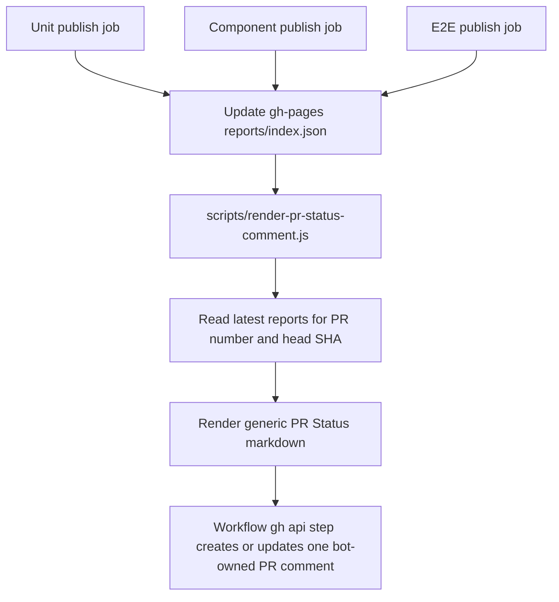

# PR Status Comment Design

## Architecture Overview

## Design Decisions

- The comment is named and marked as generic PR status:
  `<!-- everfreenote-pr-status-comment -->`.
- The script is named `render-pr-status-comment.js`; Allure-specific wording stays inside the report data, not the script contract.
- The renderer does not call GitHub APIs. Workflows use `gh api` to create or update the marked comment, which keeps file-derived report metadata out of Node outbound requests.
- The workflow only updates comments authored by `github-actions[bot]`. Marker comments created manually are ignored so smoke tests from a developer token cannot make `GITHUB_TOKEN` hit a 403 update path.
- The update step runs at the end of each successful Pages publish job. The final comment becomes complete once the last family publish job finishes.
- The existing `gh-pages-allure-publish` concurrency group serializes report publication and comment updates, so the script can read the local `.pages-existing/reports/index.json` without cross-job comment races.
- The previous `workflow_run` aggregator design was rejected for this branch because GitHub only evaluates new `workflow_run` listeners after the workflow exists on the default branch.

## Data Model

- Source data:
  `reports/index.json` from the local `gh-pages` checkout.
- Filter keys:
  `prNumber` and `sha`.
- Output rows:
  `unit`, `component`, and `e2e`, each with source workflow link and report link when available.

## Future Expansion

- Add sections below `Test Reports` for build, static analysis, deployment previews, and manual gates.
- Keep the same marker and updater script, adding data providers rather than creating separate PR comments.
