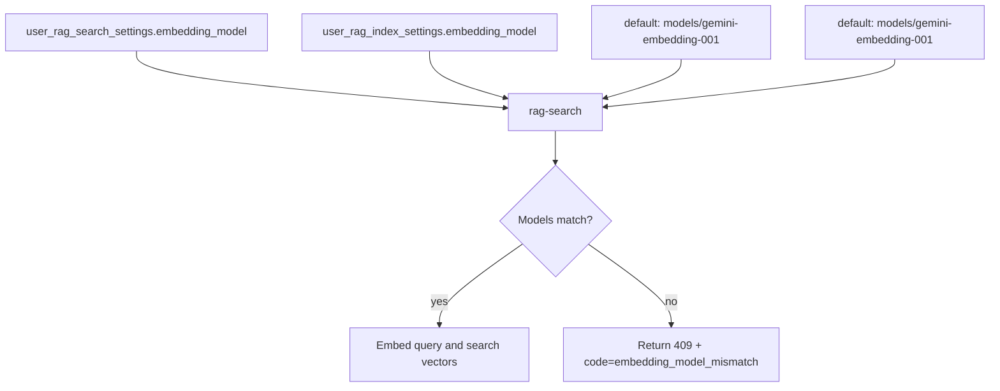
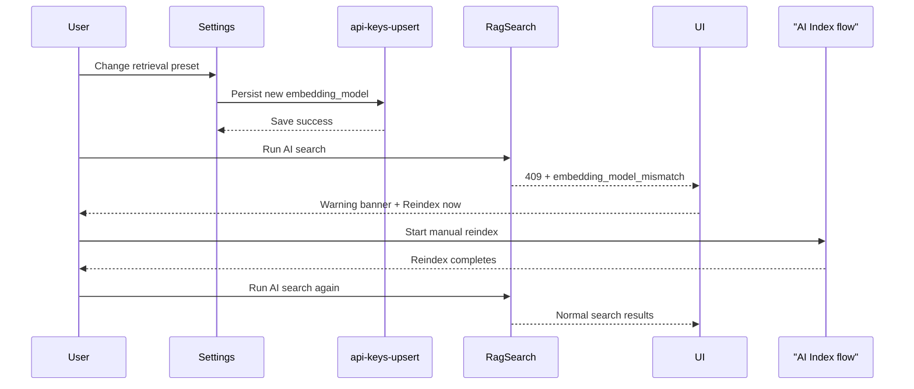
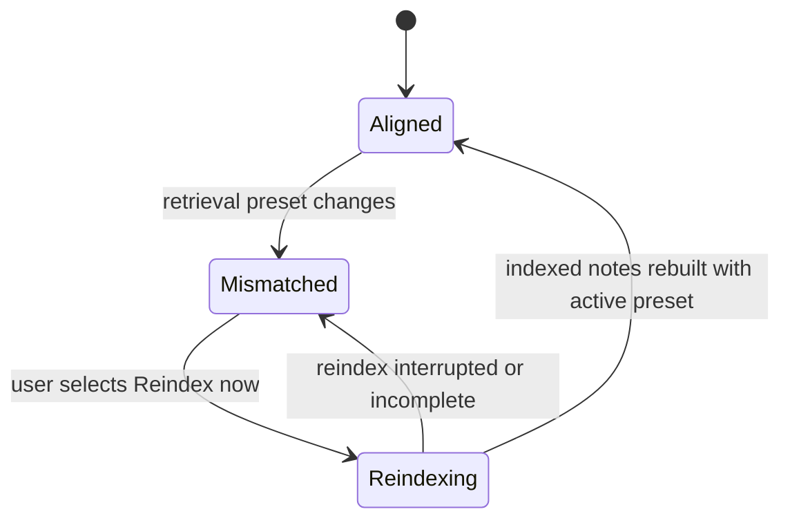

# System Design & Architecture

## Problem Statement

RAG retrieval and RAG indexing must use the same embedding space. If `rag-search` embeds the query with one model while existing note vectors were indexed with another, similarity scores are no longer trustworthy. The system therefore blocks retrieval until the indexed notes are rebuilt with the currently selected retrieval preset.

## Source Of Truth

- `rag-search` reads the active retrieval preset from `user_rag_search_settings.embedding_model`.
- `rag-search` reads the active indexing preset from `user_rag_index_settings.embedding_model`.
- If those values differ, `rag-search` stops before embedding the query and returns a structured API error.
- If either settings row is absent, the shared settings resolvers fall back to the default preset `models/gemini-embedding-001`.



## API Contract

### HTTP response

When retrieval and indexing presets diverge, `rag-search` returns:

```json
{
  "code": "embedding_model_mismatch",
  "error": "Embedding model changed. Please reindex your notes to enable search."
}
```

- HTTP status: `409 Conflict`
- Structured code: `embedding_model_mismatch`
- Human-facing message: `Embedding model changed. Please reindex your notes to enable search.`

### Frontend detection protocol

Clients must treat the mismatch as a first-class warning state when:

```typescript
response.status === 409 && body.code === "embedding_model_mismatch"
```

This check is the stable contract for web and mobile. Clients should not parse free-form Gemini or PostgREST text to detect this condition.

### Stability and versioning

- The `409 + code` contract is the compatibility boundary between backend and clients.
- The message text is intentionally stable because it is reused in warning banners, settings helpers, and test expectations.
- Future retrieval-blocking mismatch types must add new `code` values rather than overloading `embedding_model_mismatch`.
- Existing clients may safely ignore unknown codes and fall back to generic error handling.

## UX Contract

### Shared warning copy

- Warning text: `Embedding model changed. Please reindex your notes to enable search.`
- CTA label: `Reindex now`
- Severity: warning, not transient error

### Web behavior

- Search surfaces replace the normal AI-search result area with a warning banner when the mismatch response is detected.
- Retrieval settings surfaces show a proactive warning banner whenever the saved retrieval preset differs from the active indexing preset.
- The `Reindex now` CTA routes users to the existing AI Index workflow so they can reindex notes intentionally.

### Mobile behavior

- Mobile settings surfaces mirror the same warning text and CTA when the saved retrieval preset differs from the indexing preset.
- Mobile does not silently retry or background-reindex; it uses the same explicit warning and reindex flow as web.

### Expected user flow

1. User changes the retrieval embedding preset in Settings.
2. Settings persist successfully.
3. AI search becomes blocked because retrieval and indexing presets no longer match.
4. UI shows the warning banner and `Reindex now` CTA.
5. User opens the AI Index workflow and manually reindexes notes.
6. Once indexed notes match the active retrieval preset, AI search resumes normally.



## Trade-Offs

### Manual reindexing

- Pros:
  - predictable cost; no hidden Gemini usage
  - explicit user consent before re-embedding large note sets
  - clear consistency boundary: old vectors remain untouched until replacement is intentional
- Cons:
  - users hit a temporary blocked state
  - requires a visible CTA and guidance in both clients

### Automatic or background reindexing

- Pros:
  - less manual effort after changing the preset
  - smaller interruption window if the corpus is tiny
- Cons:
  - hidden compute/billing spikes
  - harder progress/error reporting across web and mobile
  - more risk of mixed-state search while some notes are rebuilt and others are not
  - requires queueing, cancellation, resumability, and stronger observability

Decision: keep reindexing manual in this phase and make the blocked state explicit.



## Cross-References

- Retrieval settings design: [feature-rag-retrieval-tuning-ui.md](feature-rag-retrieval-tuning-ui.md)
- Retrieval implementation notes: [feature-rag-retrieval-tuning-ui.md](../implementation/feature-rag-retrieval-tuning-ui.md)
- AI Index workflow design: [feature-ai-index-page.md](feature-ai-index-page.md)
- AI Index requirements: [feature-ai-index-page.md](../requirements/feature-ai-index-page.md)
