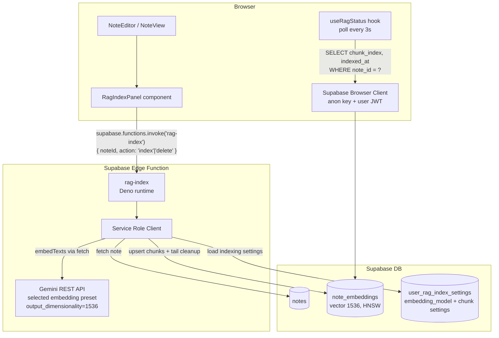

# System Design & Architecture

## Architecture Overview



**Why Edge Functions, not Next.js API routes:**
The app is a static SPA (`output: 'export'` in next.config.js). Next.js API routes require a Node.js server and don't exist in the built output. Supabase Edge Functions (Deno) run on Supabase's servers, support environment secrets, and are callable from the browser via `supabase.functions.invoke()`.

## Data Models

### `note_embeddings` (schema from migration 20260302000002)
```sql
note_embeddings (
  id           uuid PK,
  note_id      uuid FK → notes.id ON DELETE CASCADE,
  user_id      uuid FK → auth.users.id ON DELETE CASCADE,
  chunk_index  int  NOT NULL,   -- 0-based, order within note
  char_offset  int  NOT NULL,   -- character offset in plain text (for future highlighting)
  content      text NOT NULL,   -- plain text chunk (title + body fragment)
  embedding    vector(1536) NOT NULL,
  indexed_at   timestamp with time zone DEFAULT now(),
  UNIQUE (note_id, chunk_index)
)
```

### RagStatus (client-side type)
```typescript
interface RagStatus {
  chunkCount: number       // 0 = not indexed
  indexedAt: string | null // ISO timestamp of last indexing
  isLoading: boolean       // initial load
}
```

## API Design

### Supabase Edge Function `rag-index`
**Invocation:** `supabase.functions.invoke('rag-index', { body: { noteId, action } })`
**Auth:** User JWT automatically forwarded by Supabase client in Authorization header
**Secrets (server-side only):** `SUPABASE_SERVICE_ROLE_KEY`, `GEMINI_API_KEY`

**action: 'index'** flow:
1. Validate JWT → get userId
2. Fetch note `title` + `description` from `notes` (ownership check via `user_id`)
3. Strip HTML → prepend title → `chunkText(1500 chars, overlap 200)`
4. `batchEmbedContents` → Gemini REST API (`output_dimensionality: 1536`)
   - model preset comes from `user_rag_index_settings.embedding_model`
5. Upsert chunks into `note_embeddings` by `(note_id, chunk_index)`
6. Delete stale tail chunks where `chunk_index >= newChunkCount`
7. Return an explicit semantic outcome payload:
   - success: `{ outcome: "indexed", chunkCount: N }`
   - skipped-too-short: `{ outcome: "skipped", reason: "too_short", chunkCount: 0, message }`

**action: 'delete'** flow:
1. Validate JWT → get userId
2. `DELETE FROM note_embeddings WHERE note_id = ? AND user_id = ?`
3. Return `{ outcome: "deleted", deleted: true }`

**Errors:** `400` bad input, `401` unauthorized, `404` note not found, `500` Gemini/DB error

---

### Status polling (browser → Supabase direct)
No Edge Function needed — reads `note_embeddings` directly via anon key + user session:
```typescript
supabase.from('note_embeddings')
  .select('chunk_index, indexed_at')
  .eq('note_id', noteId)
```
RLS policy on `note_embeddings` enforces per-user isolation (`auth.uid() = user_id`) for these client reads.

## Component Breakdown

### `RagIndexPanel` (`ui/web/components/features/notes/RagIndexPanel.tsx`)
- `"use client"` component, receives `noteId: string`
- Uses `useSupabase()` to get the browser client for `functions.invoke()`
- Uses `useRagStatus(noteId)` for live status (polling)
- Renders: Index/Re-index button, Delete Index button, status text
- Normalizes `rag-index` payloads through a shared parser so semantic skips are not shown as success

**UI states:**

| State | Index button | Delete button | Status |
|---|---|---|---|
| Not indexed | enabled | disabled | "Not indexed" |
| Indexing... | disabled + spinner | disabled | "Indexing..." |
| Indexed | enabled (Re-index) | enabled | "N chunks · HH:MM:SS" |
| Deleting... | disabled | disabled + spinner | "Removing..." |


### `useRagStatus` (`ui/web/hooks/useRagStatus.ts`)
- Polls `note_embeddings` every 3 seconds via Supabase browser client
- Returns `{ chunkCount, indexedAt, isLoading }`
- Uses `useEffect` + `setInterval`, cleans up on unmount

### Edge Function (`supabase/functions/rag-index/index.ts`)
- Deno runtime, self-contained (chunking + embedding logic inline)
- Auth via JWT verification with service role client
- Pattern matches all other existing Edge Functions in the project
- Reads the active indexing embedding preset from persisted user settings before calling Gemini

- All chunking and embedding logic is self-contained in this Edge Function (no shared browser-side lib needed). The `ui/web/lib/rag/` directory was removed.

## Design Decisions

### Supabase Edge Functions instead of Next.js API routes
**Decision:** Use Supabase Edge Functions (Deno) for the indexing backend.
**Rationale:** The app is a static SPA (`output: 'export'`). Next.js API routes require a running Node.js server and don't exist in the static build. Edge Functions run on Supabase's Deno runtime, are available on the free tier, and keep secrets server-side.

### Polling instead of realtime subscription
**Decision:** Poll every 3 seconds via `setInterval`.
**Rationale:** Indexing a single note completes in 1–5 seconds. Supabase Realtime would add subscription setup/teardown complexity. Polling is simple and sufficient.

### Upsert + tail cleanup for reindexing
**Decision:** Upsert new chunks first, then delete stale tail chunks.
**Rationale:** Preserves existing index if embedding generation or write fails; still removes stale chunks when a note shrinks (5 chunks → 3 after edits).

### Secrets stay server-side
**Decision:** `SUPABASE_SERVICE_ROLE_KEY` and `GEMINI_API_KEY` only exist in the Edge Function environment.
**Rationale:** Security. Browser uses anon key for status reads; all writes go through the Edge Function with JWT auth.

## Non-Functional Requirements

- **Latency:** Indexing a typical note (<10 chunks) should complete in <5 seconds
- **Rate limits:** Gemini free tier (5 RPM). Single-note indexing = 1 `batchEmbedContents` call.
- **Security:** Secrets never reach the browser. User can only index/delete their own notes (userId validated in Edge Function).
- **Reliability:** If Gemini/upsert fails, previous index remains searchable. Re-index only swaps chunks after new vectors are ready.
