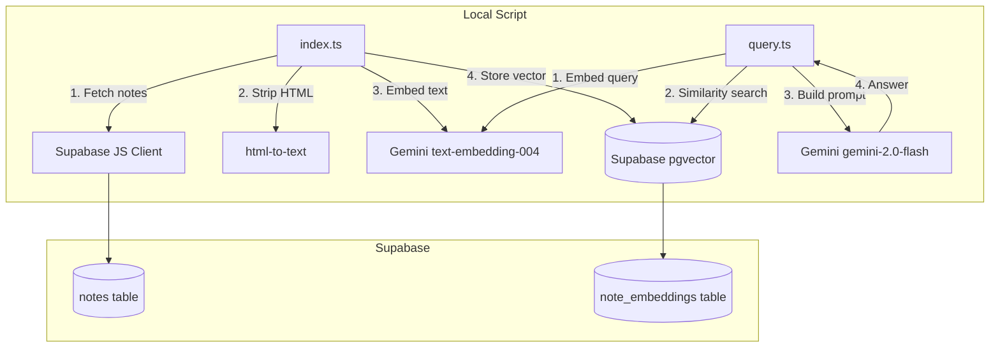

# RAG Note Indexing — Design (POC)

## Architecture Overview



**Поток индексирования:**
1. Достаём заметки пользователя из `notes` (title + description)
2. Стрипаем HTML → plain text
3. Формируем строку: `"[title]\n\n[plain text content]"`
4. Получаем эмбединг через Gemini `text-embedding-004`
5. Сохраняем в `note_embeddings` (note_id, content, embedding)

**Поток запроса:**
1. Принимаем вопрос из аргументов командной строки
2. Эмбедим вопрос тем же Gemini `text-embedding-004`
3. Делаем cosine similarity search в pgvector (топ-5 заметок, см. `config.ts`)
4. Передаём найденные заметки как контекст в Gemini LLM
5. Выводим ответ в консоль

## Data Models

### Новая таблица: `note_embeddings`

```sql
CREATE EXTENSION IF NOT EXISTS vector;

CREATE TABLE note_embeddings (
  id          uuid PRIMARY KEY DEFAULT gen_random_uuid(),
  note_id     uuid NOT NULL REFERENCES notes(id) ON DELETE CASCADE,
  user_id     uuid NOT NULL REFERENCES auth.users(id) ON DELETE CASCADE,
  content     text NOT NULL,       -- plain text (для отладки и контекста в prompt)
  embedding   vector(768) NOT NULL, -- Gemini text-embedding-004 = 768 dims
  indexed_at  timestamp with time zone DEFAULT now()
);

CREATE INDEX ON note_embeddings
  USING hnsw (embedding vector_cosine_ops)
  WITH (m = 16, ef_construction = 64);
```

### Supabase RPC функция для similarity search

```sql
CREATE OR REPLACE FUNCTION match_notes(
  query_embedding vector(768),
  match_user_id   uuid,
  match_count     int DEFAULT 5  -- соответствует config.ts matchCount
)
RETURNS TABLE (
  note_id    uuid,
  content    text,
  similarity float
)
LANGUAGE sql
AS $$
  SELECT
    note_id,
    content,
    1 - (embedding <=> query_embedding) AS similarity
  FROM note_embeddings
  WHERE user_id = match_user_id
  ORDER BY embedding <=> query_embedding
  LIMIT match_count;
$$;
```

## Component Breakdown

### `scripts/rag-poc/`

| Файл | Назначение |
|------|-----------|
| `config.ts` | Все настраиваемые параметры (модели, лимиты, HNSW) |
| `index.ts` | Индексирование всех заметок пользователя |
| `query.ts` | Задать вопрос и получить ответ |
| `lib/embeddings.ts` | Обёртка над Gemini embeddings |
| `lib/supabase.ts` | Supabase клиент для скриптов |
| `lib/html-utils.ts` | HTML → plain text |
| `.env.example` | Шаблон переменных окружения |
| `README.md` | Инструкция запуска |

### Переменные окружения (`.env`)

```
SUPABASE_URL=https://xxx.supabase.co
SUPABASE_SERVICE_ROLE_KEY=...   # service role для обхода RLS
GEMINI_API_KEY=...
RAG_USER_ID=...                  # UUID пользователя для POC
```

> Используем `service_role` key чтобы не возиться с auth в скрипте.

## Design Decisions

**Почему один вектор на заметку (без чанкинга)?**
- Для POC — проще. Большинство заметок короткие.
- Если заметки длинные — Gemini `text-embedding-004` принимает до 2048 токенов, этого достаточно.
- Чанкинг усложняет поиск и сборку контекста. Оставим для следующей итерации.

**Почему SupabaseVectorStore из LangChain, а не прямой SQL?**
- Готовая абстракция для similarity search и хранения.
- Легко переключить vector store в будущем.
- Меньше boilerplate.

**Почему `gemini-2.0-flash` для генерации?**
- Актуальная модель с улучшенным качеством по сравнению с 1.5-flash.
- Бесплатная квота достаточна для POC.
- `temperature: 0.2` снижает галлюцинации — важно для ответов на основе фактов из заметок.

**Почему `service_role` key в скрипте?**
- Скрипт локальный, не деплоится.
- Позволяет читать заметки без настройки JWT аутентификации.

## API / CLI Interface

### `index.ts`
- **Вход:** нет аргументов. Читает `RAG_USER_ID` из `.env`.
- **Выход:** прогресс-лог в stdout. Формат: `[N/M] Indexed: <note title>`
- **Код завершения:** 0 при успехе, 1 при критической ошибке.

### `query.ts`
- **Вход:** `process.argv[2]` — строка вопроса. Обязательный.
- **Выход (stdout):**
  ```
  Вопрос: <вопрос>

  Ответ:
  <текст ответа от LLM>

  Источники:
  - <title заметки 1> (similarity: 0.87)
  - <title заметки 2> (similarity: 0.81)
  ```
- **Если заметок не найдено:** выводит `"По вашим заметкам ответа не найдено."` без вызова LLM.

## Non-Functional Requirements

- Скрипт индексирует 100 заметок менее чем за 2 минуты (с учётом rate limits Gemini free tier)
- Similarity search отвечает менее чем за 1 секунду
- Скрипт идемпотентен: повторный запуск обновляет эмбединги (upsert по note_id)
