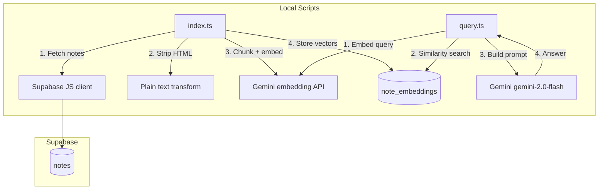

# RAG Note Indexing - Design (POC)

## Architecture Overview



## Data Model

```sql
CREATE TABLE note_embeddings (
  id           uuid PRIMARY KEY DEFAULT gen_random_uuid(),
  note_id      uuid NOT NULL REFERENCES notes(id) ON DELETE CASCADE,
  user_id      uuid NOT NULL REFERENCES auth.users(id) ON DELETE CASCADE,
  chunk_index  int NOT NULL,
  char_offset  int NOT NULL,
  content      text NOT NULL,
  embedding    vector(1536) NOT NULL,
  indexed_at   timestamp with time zone DEFAULT now()
);
```

Model choice:

- Embeddings: `models/gemini-embedding-001` with `outputDimensionality=1536`
- Generation: `gemini-2.0-flash`

## RPC Design

```sql
CREATE OR REPLACE FUNCTION match_notes(
  query_embedding vector(1536),
  match_user_id   uuid,
  match_count     int DEFAULT 5
)
RETURNS TABLE (
  note_id      uuid,
  chunk_index  int,
  char_offset  int,
  content      text,
  similarity   float
)
LANGUAGE sql
AS $$
  SELECT
    note_id,
    chunk_index,
    char_offset,
    content,
    1 - (embedding <=> query_embedding) AS similarity
  FROM note_embeddings
  WHERE user_id = match_user_id
  ORDER BY embedding <=> query_embedding
  LIMIT GREATEST(1, LEAST(match_count, 100));
$$;
```

## Environment Variables

```text
SUPABASE_URL=https://xxx.supabase.co
SUPABASE_SERVICE_ROLE_KEY=...
GEMINI_API_KEY=...
RAG_USER_ID=...
```

## CLI Output Format (Example)

```text
Question: <question>

Answer:
<llm answer>

Sources:
- <note title 1> (similarity: 0.87)
- <note title 2> (similarity: 0.81)
```

## Notes

- This POC doc is historical for script-based exploration.
- UI feature implementation moved to Supabase Edge Function `supabase/functions/rag-index`.
