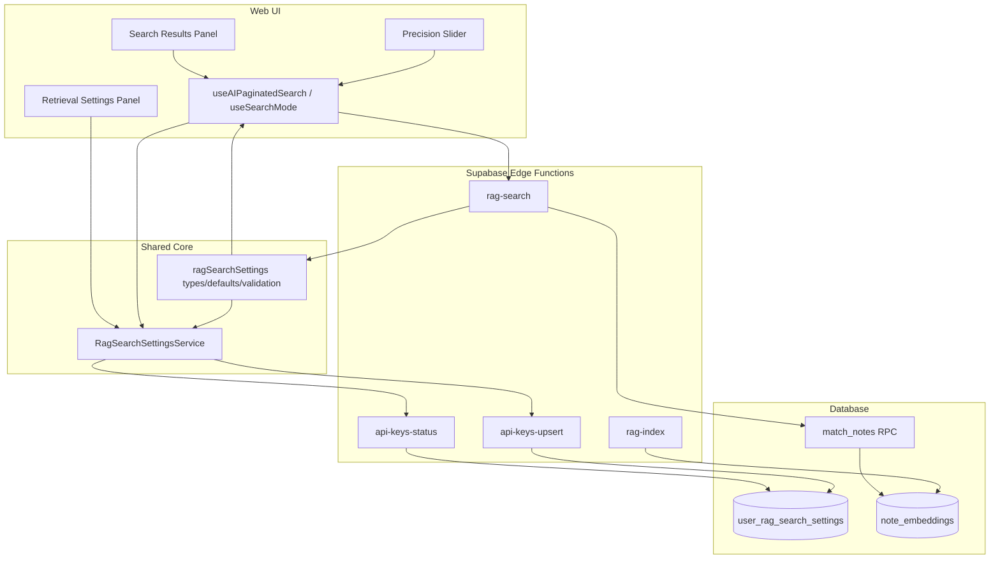

# System Design & Architecture

## Architecture Overview
**What is the high-level system structure?**



- Web and mobile Settings expose persisted retrieval configuration, including editable values and read-only system metadata.
- Web search consumes persisted defaults plus a search-time precision slider.
- Shared core owns retrieval settings schema, defaults, validation, and service contracts.
- `rag-search` keeps Gemini query embedding and vector retrieval responsibilities.
- `rag-index` remains unchanged except for continuing to expose fixed indexing task type and output dimensionality as read-only system information.

## Data Models
**What data do we need to manage?**

### Persisted retrieval settings
```typescript
interface RagSearchEditableSettings {
  top_k: number
  similarity_threshold: number
  embedding_model: "models/gemini-embedding-001" | "models/gemini-embedding-2-preview"
}

interface RagSearchReadonlySettings {
  output_dimensionality: number
  task_type_document: "RETRIEVAL_DOCUMENT"
  task_type_query: "RETRIEVAL_QUERY"
  load_more_overfetch: 1
  max_top_k: 100
  offset_delta_threshold: number
}

interface RagSearchSettings extends RagSearchEditableSettings, RagSearchReadonlySettings {}
```

### Storage
```sql
user_rag_search_settings (
  user_id uuid primary key references auth.users(id) on delete cascade,
  top_k int not null,
  similarity_threshold numeric not null,
  embedding_model text not null default 'models/gemini-embedding-001',
  updated_at timestamptz not null default now()
)
```

### Runtime state in web search
```typescript
interface PrecisionSliderState {
  draftThreshold: number
  committedThreshold: number
}
```

- `draftThreshold` changes while dragging.
- `committedThreshold` is the value used for actual search requests and persisted user-state sync.

## API Design
**How do components communicate?**

### `api-keys-status`
- Extend the response payload with `ragSearch`.
- Purpose: load persisted retrieval settings together with existing Gemini/indexing settings.

Example response fragment:
```typescript
{
  gemini: { configured: true },
  ragIndexing: { ... },
  ragSearch: {
    top_k: 15,
    similarity_threshold: 0.55,
    embedding_model: "models/gemini-embedding-001",
    output_dimensionality: 1536,
    task_type_document: "RETRIEVAL_DOCUMENT",
    task_type_query: "RETRIEVAL_QUERY",
    load_more_overfetch: 1,
    max_top_k: 100,
    offset_delta_threshold: 300
  }
}
```

### `api-keys-upsert`
- Extend the accepted payload to persist retrieval settings.
- Validation rules:
  - `top_k` integer, `1..100`
  - `similarity_threshold` number, `0..1`
  - `embedding_model` must be one of the supported Gemini presets
- Existing Gemini and indexing update flows remain backward compatible.

### `rag-search`
- Continue accepting numeric retrieval parameters directly.
- Request contract remains numeric, but the caller now derives values from persisted user settings plus committed slider state.
- Query embedding model is now resolved server-side from `user_rag_search_settings`, independently from indexing settings.

Request:
```typescript
{
  query: string
  topK: number
  threshold: number
  filterTag?: string | null
}
```

Response change:
```typescript
{
  chunks: RagChunk[]
  hasMore: boolean
  availableChunkCount: number
}
```

### `+1` overfetch contract
- For a requested visible count `N`, backend retrieval asks `match_notes` for `N + 1`.
- If more than `N` chunks survive thresholding, `hasMore = true` and only the first `N` visible chunks are returned.
- If `N` or fewer chunks survive thresholding, `hasMore = false`.

This removes the old UI heuristic that guessed `hasMore` from `returnedCount >= requestedTopK`.

## Component Breakdown
**What are the major building blocks?**

### Shared core
- New retrieval-settings module in core:
  - defaults
  - read-only constants
  - validation
  - coercion helpers
- New service in core mirroring the indexing-settings service pattern.

### Web settings UI
- New or extended settings panel to expose retrieval settings.
- Editable:
  - `topK`
  - `embedding_model` via a preset dropdown
- Read-only:
  - `task_type_document`
  - `task_type_query`
  - `output_dimensionality`
  - overfetch behavior
  - retrieval max cap
  - offset dedup threshold when relevant to visible behavior

### Web search UI
- Remove `AiSearchPresetSelector`.
- Add a precision slider with English labels.
- Suggested copy:
  - label: `Precision`
  - helper scale: `More results` to `Cleaner results`
- Slider range: `0.00..1.00`
- Slider step / commit granularity: `0.05`
- Search is retriggered only from slider commit when the value changed and an AI search query is already active.
- Slider commit also persists the new `similarity_threshold` to the user's retrieval settings.

### Search hooks
- `useSearchMode` no longer persists a preset.
- `useAIPaginatedSearch` uses:
  - persisted `topK` as page size / initial visible retrieval count
  - committed similarity threshold from settings or committed slider interaction
- `Load more` increments by persisted `topK`.

## Design Decisions
**Why did we choose this approach?**

### 1. Persist `topK` as a user setting
- Reason: `topK` is a retrieval breadth preference, not a one-off UI preset.
- Benefit: same default behavior across sessions and future clients.

### 2. Move threshold control into active search UI
- Reason: threshold is most useful as an interactive retrieval-quality control while viewing results.
- Benefit: users can quickly tune precision/recall without opening Settings for every search.

### 3. Commit-on-release slider behavior
- Reason: semantic search is networked and can be costly or noisy if retriggered on every drag event.
- Benefit: one request per intentional slider adjustment.

### 4. Keep Gemini task types fixed and visible
- Reason: task types are system constraints, not user preferences.
- Benefit: transparency without introducing unsupported combinations.

### 5. Keep retrieval settings logic in core, shared across web and mobile UI
- Reason: retrieval settings are now edited on both clients and must stay identical.
- Benefit: avoids re-modeling settings or introducing client-specific preset drift.

### 6. Use backend `+1` overfetch instead of client-side guesswork
- Reason: `Load more` should hide predictably when no more backend results exist.
- Trade-off: one extra chunk candidate per request, which is small compared to improved UX.

## Non-Functional Requirements
**How should the system perform?**

- Performance:
  - slider drag updates must remain local and instant
  - search refetch occurs once per committed slider change
- Reliability:
  - existing AI search continues working for users with no custom retrieval settings via defaults
  - indexing/search task types remain stable
- Security:
  - retrieval settings are scoped per authenticated user
  - no new secrets are introduced
- Maintainability:
  - shared retrieval settings code lives in core
  - web-specific interaction logic stays in web hooks/components
- Compatibility:
  - all UI strings introduced by this feature are English
  - mobile is not implemented yet, but the core data model is ready for reuse
