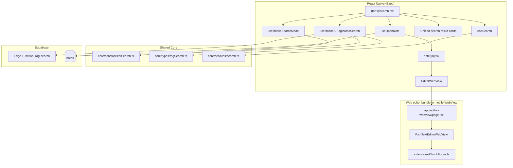

# System Design & Architecture

## Architecture Overview



## Key Decisions

### 1. Keep separate hooks for regular and AI search, coordinate them at the screen level
- `useSearch` remains the owner of regular FTS/tag search.
- A new mobile AI hook mirrors web `useAIPaginatedSearch`.
- The screen decides which hook is active and only renders/paginates the active mode.

This keeps parity with web behavior while preserving the already working regular-search hook.

### 2. Mirror web AI grouping and pagination semantics
- Reuse `SEARCH_PRESETS`, `AI_SEARCH_MIN_QUERY_LENGTH`, and `OFFSET_DELTA_THRESHOLD`.
- AI results are fetched cumulatively with growing `topK`.
- Each fetch replaces the accumulated grouped note results so ranking/snippets stay fresh.

This avoids mobile/web drift in note grouping and chunk deduplication.

### 3. Use persisted mobile search mode state
- Introduce a small mobile hook backed by AsyncStorage.
- Persist:
  - `isAIEnabled`
  - `preset`
  - `viewMode`

This matches web intent while using the right mobile storage primitive.

### 4. Add note open-in-context via navigation params + queued editor focus
- AI result tap calls an enhanced `useOpenNote`.
- `useOpenNote` can optionally receive chunk focus metadata.
- `note/[id].tsx` reads pending chunk focus params, adjusts offset relative to note body, and forwards the request to `EditorWebView`.
- `EditorWebView` exposes `scrollToChunk(charOffset, chunkLength)`.
- `app/editor-webview/page.tsx` and `RichTextEditorWebView` support the chunk-focus bridge and rely on the shared `ChunkFocusExtension`.

This is the cleanest path because the editor already lives behind a bridge and the web extension already solves highlight lifecycle.

### 5. Unify note result visuals across regular and AI search
- Keep one mobile card language for note results.
- Regular search results and AI note groups should share core layout, spacing, tag treatment, and metadata style.
- AI-specific cards can add score and fragment affordances, but the base structure should feel like the same product surface.

## Component Breakdown

### `useMobileSearchMode`
Location: `ui/mobile/hooks/useMobileSearchMode.ts`

Responsibilities:
- load/save search UI mode from AsyncStorage
- expose:
  - `isAIEnabled`
  - `preset`
  - `viewMode`
  - setters

### `useMobileAIPaginatedSearch`
Location: `ui/mobile/hooks/useMobileAIPaginatedSearch.ts`

Responsibilities:
- invoke `client.functions.invoke('rag-search')`
- group chunks by note
- deduplicate nearby chunks
- manage cumulative loading and `loadMore`
- expose:
  - `noteGroups`
  - `isLoading`
  - `error`
  - `refetch`
  - `aiHasMore`
  - `aiLoadingMore`
  - `loadMoreAI`
  - `resetAIResults`

### Search UI components
Proposed mobile components:
- `AiSearchToggleMobile`
- `AiSearchPresetSelectorMobile`
- `AiSearchViewTabsMobile`
- `SearchResultNoteCard`
- `SearchResultChunkCard`

These keep the screen readable and make testing more focused.

### Note editor chunk focus path

```mermaid
sequenceDiagram
    participant User
    participant Search as SearchScreen
    participant Open as useOpenNote
    participant Note as note/[id].tsx
    participant WV as EditorWebView
    participant Page as editor-webview/page.tsx
    participant Editor as RichTextEditorWebView

    User->>Search: Tap AI result
    Search->>Open: openNote(note, chunkFocus)
    Open->>Note: router.push(note route + focus params)
    Note->>WV: scrollToChunk(bodyOffset, chunkLength)
    WV->>Page: postMessage(SCROLL_TO_CHUNK)
    Page->>Editor: scrollToChunk(...)
    Editor->>Editor: apply ChunkFocus decorations + scroll
    User->>Editor: Tap in editor
    Editor->>Editor: clear highlight via ChunkFocus mousedown handler
```

## Data Contracts

### Mobile AI search mode
```ts
type MobileSearchModeState = {
  isAIEnabled: boolean
  preset: SearchPreset
  viewMode: 'note' | 'chunk'
}
```

### Pending chunk focus
```ts
type PendingChunkFocus = {
  noteId: string
  charOffset: number
  chunkLength: number
  requestId: string
}
```

## Virtualization Strategy

### Regular search
- Keep `FlashList` for existing note/tag/FTS results.

### AI search
- Use `FlashList` as well.
- In `notes` view: each row is a grouped note card.
- In `chunks` view: flatten to chunk items ahead of the list and paginate through cumulative grouped results.
- `onEndReached` should call only the active loader:
  - regular mode -> `fetchNextPage`
  - AI mode -> `loadMoreAI`

This guarantees only one infinite loader is active at a time.

## Accessibility and Interaction Rules

- AI toggle and view tabs must expose disabled state when selection mode is active.
- Disabled controls should still explain why they are blocked.
- Note/chunk result cards must remain clearly tappable.
- Chunk focus highlight must not trap the user; a normal tap in the editor clears it.

## Risks & Mitigations

| Risk | Impact | Mitigation |
|------|--------|-----------|
| AI and regular search fetch simultaneously | High | Gate hooks and load-more handlers by active mode only |
| Chunk focus applies before editor is ready | High | Queue focus request in note screen and editor bridge |
| Mobile AI list becomes slow with many grouped notes | Medium | Keep FlashList virtualization and incremental loading |
| Web/mobile ranking diverges | Medium | Reuse web grouping/dedup constants and hook semantics |
| Selection mode breaks when switching modes | Medium | Centralize guard logic in search screen state |
