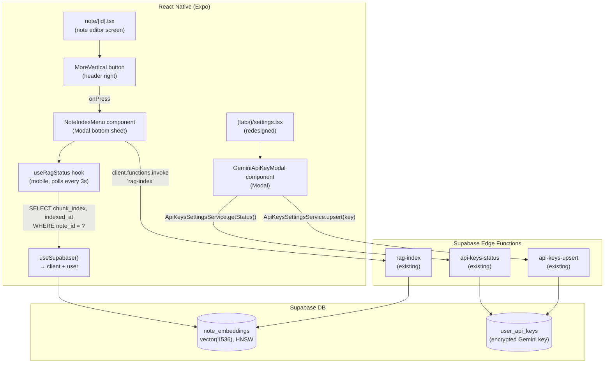

# System Design & Architecture

## Architecture Overview



**Key principles:**
- No new backend — reuses existing `rag-index`, `api-keys-status`, `api-keys-upsert` Edge Functions.
- Mobile `useRagStatus` hook is a copy-adapt of the web hook, using `client` instead of `supabase` from mobile's `useSupabase()`.
- `ApiKeysSettingsService` from `core/services/apiKeysSettings.ts` is directly reused on mobile.

## Data Models

### Client-side: `RagStatus` (same as web)
```typescript
interface RagStatus {
  chunkCount: number        // 0 = not indexed
  indexedAt: string | null  // ISO timestamp of latest chunk
  isLoading: boolean
  refresh: () => void       // manual re-fetch trigger
}
```

### No DB schema changes
All tables (`note_embeddings`, `user_api_keys`) already exist. No migrations needed.

## API Design

### `rag-index` Edge Function (already deployed)
- **Action `index` / `reindex`:** embeds note content → upserts chunks → returns `{ chunkCount: N }`
- **Action `delete`:** removes all embeddings for note → returns `{ deleted: true }`
- Invoked via: `client.functions.invoke('rag-index', { body: { noteId, action } })`

### `api-keys-status` / `api-keys-upsert` Edge Functions (already deployed)
- Used by `ApiKeysSettingsService` — no change needed.
- Invoked via: `new ApiKeysSettingsService(client).getStatus()` / `.upsert(key)`

### Status polling (mobile → Supabase direct)
```typescript
client
  .from('note_embeddings')
  .select('chunk_index, indexed_at')
  .eq('note_id', noteId)
  .eq('user_id', user.id)
```
RLS policy enforces per-user isolation.

## Component Breakdown

### 1. `NoteIndexMenu` (`ui/mobile/components/NoteIndexMenu.tsx`)
A **Modal bottom sheet** component.

**Props:**
```typescript
interface NoteIndexMenuProps {
  noteId: string
  visible: boolean
  onClose: () => void
}
```

**Internal state:**
- Uses `useRagStatus(noteId)` for chunk count and timestamp.
- `operation: 'indexing' | 'deleting' | null` — in-flight operation state.
- `deleteConfirmVisible: boolean` — nested confirmation modal for delete.

**UI layout (bottom sheet):**
```
┌────────────────────────────────┐
│  AI Index                      │
│  Status: 5 chunks · 14:32:01   │
├────────────────────────────────┤
│  🗄️  Index note                │  ← disabled + spinner when indexing
│  🔄  Re-index note             │  ← only shown when indexed
│  🗑️  Remove from index         │  ← disabled when not indexed
├────────────────────────────────┤
│  [Cancel]                      │
└────────────────────────────────┘
```

Actually simplified:
- **One action button** for index/re-index (label changes based on `isIndexed`).
- **Remove from index** button (disabled when `chunkCount === 0`).
- Status line at top.
- Cancel closes the modal.

**Confirmation sub-modal:** Standard `Modal` with "Remove from AI index?" title, description, Cancel and Remove buttons.

---

### 2. `useRagStatus` (`ui/mobile/hooks/useRagStatus.ts`)
Mobile adaptation of `ui/web/hooks/useRagStatus.ts`.

- Uses `useSupabase()` from mobile provider → `client` (not `supabase`).
- Identical polling logic (3-second interval, `cancelled` flag, `refreshTick`).
- Same return type: `{ chunkCount, indexedAt, isLoading, refresh }`.

---

### 3. Updated `note/[id].tsx`
- **Add `⋮` button** (`MoreVertical` from `lucide-react-native`) in `headerRight`, to the right of the existing Trash icon and ThemeToggle.
- **State:** `isNoteMenuVisible: boolean`.
- **Render:** `<NoteIndexMenu noteId={id} visible={isNoteMenuVisible} onClose={() => setIsNoteMenuVisible(false)} />`

---

### 4. `GeminiApiKeySection` (`ui/mobile/components/settings/GeminiApiKeySection.tsx`)
An inline section component used by the Settings screen — renders a pressable row that opens a full-screen Modal.

**Modal content:**
- Header: "Google / Gemini API Key"
- Status badge: green "Configured" or grey "Not configured"
- Password `TextInput` to enter new key ("Leave empty to keep current" placeholder when configured)
- Save / Cancel buttons
- Error and success inline messages

Uses `ApiKeysSettingsService(client)` directly.

---

### 5. Redesigned `(tabs)/settings.tsx`
Replace the flat layout with **sections**:

```
┌─────────────────────────────────┐
│  APPEARANCE                     │
│  [System / Light / Dark radio]  │
├─────────────────────────────────┤
│  INTEGRATIONS                   │
│  > Google / Gemini API    [key] │  ← opens GeminiApiKeySection modal
│  > WordPress              [Soon]│  ← disabled, "Coming soon"
├─────────────────────────────────┤
│  DATA                           │
│  > Import notes           [Soon]│  ← disabled
│  > Export notes           [Soon]│  ← disabled
├─────────────────────────────────┤
│  ACCOUNT                        │
│  [Sign Out button]              │
│  [Delete account link]          │
└─────────────────────────────────┘
```

**New sub-components introduced:**
- `SettingsSectionHeader` — small labeled header text
- `SettingsRow` — generic pressable row with title, optional right badge/icon

## Design Decisions

### Bottom-sheet Modal instead of ActionSheet
**Decision:** Use a custom `Modal` with a bottom-anchored `View` for the note overflow menu.
**Rationale:** React Native's `ActionSheetIOS` is iOS-only. A custom modal is consistent with the existing Delete-account modal pattern already in the codebase.

### Reuse `core/services/apiKeysSettings.ts` directly on mobile
**Decision:** Import `ApiKeysSettingsService` in the mobile settings component.
**Rationale:** The service only depends on `SupabaseClient` which is available on mobile via `client`. No platform-specific code. Zero duplication.

### Mobile `useRagStatus` as a separate hook file
**Decision:** Copy-adapt `ui/web/hooks/useRagStatus.ts` → `ui/mobile/hooks/useRagStatus.ts`.
**Rationale:** The web hook imports from `@ui/web/providers/SupabaseProvider` which doesn't exist on mobile. The logic is identical — only the import path changes. Keeping them separate avoids cross-platform coupling.

### "Coming soon" rows — visible but disabled
**Decision:** WordPress, Import, Export rows are rendered with `opacity: 0.5`, a "Soon" badge, and no `onPress` handler.
**Rationale:** Communicates future intent, reserves visual space, prevents accidental taps, avoids placeholder screens.

### `⋮` button stays in header (does not replace ThemeToggle)
**Decision:** Add `MoreVertical` button to the right of Trash and ThemeToggle in `headerRight`.
**Rationale:** ThemeToggle is a frequently used quick-action; moving it to Settings would hurt discoverability. The header can hold one more icon.

## Non-Functional Requirements

- **Responsiveness:** Bottom sheet opens with a subtle slide-up animation (React Native `Modal` with `animationType="slide"`).
- **Security:** No Gemini API key is ever stored in memory longer than the modal session. `ApiKeysSettingsService` sends it directly to the Edge Function.
- **Rate limits:** Same as web — 1 `batchEmbedContents` call per index action; user is responsible for not re-indexing too fast.
- **Offline:** If network is unavailable, operations fail with a toast error; status stays at last known state.
- **Accessibility:** All new buttons have `accessibilityLabel`, `accessibilityRole="button"`, and appropriate `accessibilityState.disabled`.
