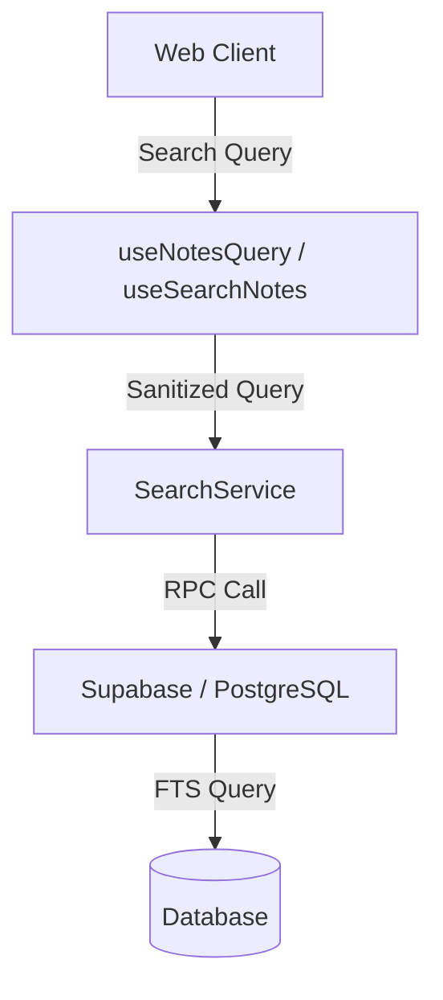

# Системный дизайн и архитектура

## Обзор архитектуры
**Какова высокоуровневая структура системы?**

Архитектура остается в значительной степени неизменной, но поток данных для поисковых запросов будет уточнен.

- **Client**: Захватывает ввод пользователя.
- **Hook**: Выполняет debounce и управляет состоянием.
- **SearchService**: Отвечает за санитарную обработку ввода и построение правильного вызова RPC или запроса Supabase.
- **Supabase**: Выполняет функцию `search_notes_fts`.

## Модели данных
**Какие данные нам нужно управлять?**

Изменений в схеме базы данных не ожидается. Таблица `notes` и сигнатура функции `search_notes_fts` остаются прежними.

## Дизайн API
**Как компоненты взаимодействуют?**

- **SearchService.searchNotes(userId, query, options)**:
  - Входная строка `query` будет сырым пользовательским вводом.
  - Сервис будет внутренне использовать `buildTsQuery` (или обновленную логику), чтобы гарантировать, что строка, передаваемая в Supabase, безопасна и синтаксически корректна для `to_tsquery`.

## Разбивка компонентов
**Каковы основные строительные блоки?**

- **`core/utils/search.ts`**:
  - `buildTsQuery(query: string)`: Требует обновления для более надежной обработки специальных символов. Вместо простого удаления, она должна экранировать их или форматировать так, чтобы `to_tsquery` интерпретировал их правильно, или удалять их только в том случае, если они абсолютно недопустимы для FTS, не вызывая ошибок при пустом результате.
  - **Текущая логика**: Заменяет `[&|!():<>]` на пробел. Выбрасывает ошибку, если результат пуст.
  - **Новая логика**:
    1. Должна обрабатывать случаи, когда после очистки строка становится пустой (например, запрос `)`), возвращая безопасное значение или пустой результат, но не выбрасывая исключение.
    2. **Стратегия очистки**: Мы будем удалять специальные символы FTS (`&`, `|`, `!`, `(`, `)`, `:`, `<`, `>`), заменяя их на пробелы. Это предотвратит синтаксические ошибки в `to_tsquery`. Мы не будем пытаться экранировать их для поиска как литералов в этой итерации, так как стандартный парсер FTS все равно их игнорирует. Главная цель — стабильность.
    3. Рассмотреть возможность использования `plainto_tsquery` (через логику на клиенте или изменение RPC), если мы хотим трактовать ввод как простой текст. Однако, так как мы формируем запрос с `:*` для префиксного поиска, нам нужно аккуратно экранировать спецсимволы.

## Решения по дизайну
**Почему мы выбрали этот подход?**

- **Санитарная обработка в утилите**: Мы сохраняем логику в `core/utils/search.ts` для обеспечения согласованности во всем приложении и простоты тестирования.
- **Обработка ошибок**: Вместо того чтобы выбрасывать ошибку на клиенте при вводе спецсимволов, мы должны либо игнорировать их, либо искать их как текст (если возможно), чтобы не прерывать пользовательский опыт.

## Нефункциональные требования
**Как система должна работать?**

- **Производительность**: Санитарная обработка должна быть мгновенной.
- **Безопасность**: Ввод должен быть очищен для предотвращения SQL-инъекций (хотя параметры RPC помогают) и "инъекций синтаксиса", которые вызывают ошибки БД (например, незакрытые скобки в `to_tsquery`).
