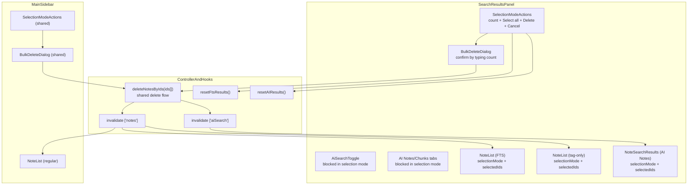

# System Design & Architecture

## Architecture Overview



Key principle: two independent selection contexts (search panel and main sidebar), one shared bulk delete operation, one shared confirmation flow, and shared selection actions UI.

## Data Models

No new backend data models. Main state is UI-local state in `SearchResultsPanel`:

```ts
const [panelSelectionMode, setPanelSelectionMode] = useState(false)
const [panelSelectedIds, setPanelSelectedIds] = useState<Set<string>>(new Set())
const [panelBulkDeleting, setPanelBulkDeleting] = useState(false)
```

Shared selection state for the sidebar remains in `useNoteSelection`.

## API Design

No new backend API.

Shared delete helper:

```ts
deleteNotesByIds(ids: string[]): Promise<{
  total: number
  failed: number
  queuedOffline: boolean
}>
```

Responsibilities:
- online delete (`Promise.allSettled`) or offline queue path
- toasts for success/failure
- invalidate `['notes']` and `['aiSearch']`
- clear selected note reference

AI search uses `useAIPaginatedSearch` with accumulated results and load-more behavior mirroring FTS.

## Component Breakdown

### `SearchResultsPanel.tsx`
- Owns local panel selection state.
- Uses shared `SelectionModeActions` when selection mode is active.
- Uses shared `BulkDeleteDialog` through `useBulkDeleteConfirm`.
- Supports three result paths:
  - FTS (`NoteList` with FTS data)
  - tag-only (`NoteList` with `useNotesQuery` by tag)
  - AI Notes (`NoteSearchResults`)
- On confirmed delete:
  - calls `deleteNotesByIds`
  - resets FTS or AI accumulated results based on current view
  - exits selection mode only when there are no failed deletions
- Auto-clears selection mode when selected count drops to `0`.

### `SelectionModeActions.tsx` (shared)
- Single reusable action bar for both sidebar and search panel.
- Compact count display + `Select all` + `Delete (N)` + `Cancel`.

### `BulkDeleteDialog.tsx` + `useBulkDeleteConfirm.ts`
- Shared confirmation flow in both contexts.
- Confirm requires typing selected count.

### `NoteCard.tsx` and `NoteSearchItem.tsx`
- Desktop: checkbox appears on hover when not in selection mode.
- Mobile: long press enters selection mode and selects item.
- In selection mode, card body toggles selection (not navigation).

### `useLongPress.ts`
- Pointer-based long press with movement threshold and cancel on pointer up/leave/cancel.

### `useNoteSearch.ts`
- `resetFtsResults()` exposed.
- Tag filter matrix supported:
  - `tag-only` (no query)
  - `query-only`
  - `query + tag`

### `useAIPaginatedSearch.ts`
- Accumulated AI note groups with load-more and reset.
- `aiOffset`, `aiHasMore`, `aiLoadingMore`, `resetAIResults`, `loadMoreAI`.

### `AiSearchToggle.tsx` and `AiSearchViewTabs.tsx`
- Blocked while panel selection mode is active.
- Hint text: `Remove selection to switch`.
- Desktop: tooltip opens on hover.
- Mobile: tooltip toggles on tap and closes on outside tap.

## Design Decisions

### Independent selection contexts
Search panel and sidebar keep separate selection state to avoid cross-surface conflicts.

### Shared action and confirmation components
`SelectionModeActions` and `BulkDeleteDialog` are reused in both contexts to avoid behavior drift.

### Mode-switch blocking with explicit hint
Switching FTS/AI mode during active selection is blocked; user must cancel selection first.

### Auto-exit on zero selected
Selection mode exits automatically when no items remain selected. This keeps UI concise and avoids empty action state.

### Tag-filter behavior matrix
Search behavior is explicit and stable:
- `query + no tag` -> text results
- `no query + tag` -> tag-only results
- `query + tag` -> combined filtering

## Non-Functional Requirements

- Performance: bulk operations remain batched; cache invalidation is coarse-grained by query key.
- Offline: same queue path as existing bulk delete.
- Regression safety: main sidebar bulk delete behavior remains intact.
- Accessibility note: pointer and touch discoverability for blocked mode-switch controls is implemented; keyboard-focus behavior for disabled controls should be validated and improved if needed.
