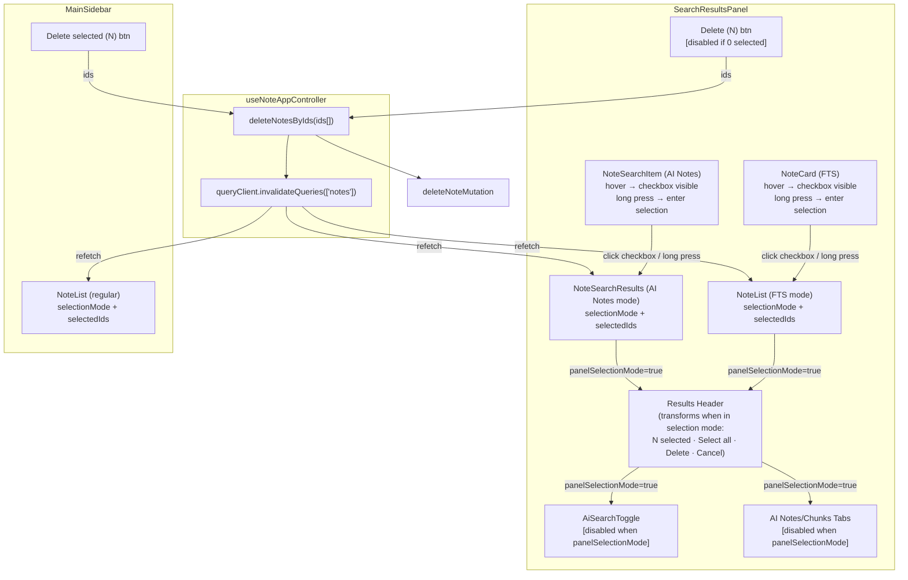

# System Design & Architecture

## Architecture Overview



**Key principle**: Two fully independent selection contexts (search panel + main list), one shared delete operation, one shared cache invalidation that syncs both. Within the search panel, a single `panelSelectionMode`/`panelSelectedIds` state covers both FTS and AI Notes views — the toggle between them is blocked while selection is active.

## Data Models

No new data models. Selection state is ephemeral UI state:

```ts
// Local to SearchResultsPanel (new)
const [panelSelectionMode, setPanelSelectionMode] = useState(false)
const [panelSelectedIds, setPanelSelectedIds] = useState<Set<string>>(new Set())
const [panelBulkDeleting, setPanelBulkDeleting] = useState(false)
```

The existing `useNoteSelection` state (in `useNoteAppController`) remains unchanged and drives the main list.

## API Design

No new backend API for deletion. The feature reuses:
- `deleteNoteMutation.mutateAsync({ id, silent: true })` — existing Supabase delete
- `enqueueBatchAndDrainIfOnline(...)` — existing offline queue
- `queryClient.invalidateQueries({ queryKey: ['notes'] })` — invalidates main list + FTS
- `queryClient.invalidateQueries({ queryKey: ['aiSearch'] })` — invalidates AI results (new call in `deleteNotesByIds`)

**AI pagination** requires a new `useAIPaginatedSearch` hook (or extension of `useAISearch`) that supports accumulated results + load-more, mirroring the `useNoteSearch` FTS pagination pattern. The Supabase `rag-search` function already accepts `topK` — pagination can be implemented by increasing `topK` on each load-more, or by adding offset support to the function. See `useNoteSearch.ts` as the reference implementation.

The controller exposes a generic `deleteNotesByIds(ids: string[])` helper — see Component Breakdown.

## Component Breakdown

### `SearchResultsPanel.tsx` — changes
- Add local state: `panelSelectionMode`, `panelSelectedIds`, `panelBulkDeleting`
- **No "Select" button** — selection mode is entered via card interaction (see NoteCard / NoteSearchItem below)
- Results header transforms when `panelSelectionMode` is true: shows "N selected", "Select all", "Delete (N)" [disabled at 0], "Cancel"
- Pass `selectionMode={panelSelectionMode}` and `selectedIds={panelSelectedIds}` to `NoteList` (FTS path) and to `NoteSearchResults` (AI Notes path)
- `AiSearchToggle` receives `disabled={panelSelectionMode}` and `title="Remove selection to switch"`
- AI Notes/Chunks view tabs receive `disabled={panelSelectionMode}` and same tooltip
- "Delete (N)" calls `controller.deleteNotesByIds(Array.from(panelSelectedIds))` then resets panel state; if current view is FTS calls `controller.resetFtsResults()`, if AI Notes calls `controller.resetAIResults()`

### `NoteCard.tsx` — changes (affects both main list AND search panel FTS cards)
- **Desktop**: when `selectionMode` is false, render checkbox with `opacity-0 group-hover:opacity-100` (top-left corner). Clicking it calls `onToggleSelect` which propagates to parent to enter selection mode.
- **Mobile**: add `useLongPress` hook (pointer events + 500ms timeout) on the card root element; long press triggers `onToggleSelect` → enters selection mode.
- When `selectionMode` is true: checkbox always visible (existing behaviour unchanged).
- Applies to both `compact` and `search` variants.
- **Note**: These changes improve UX for both the main list and the FTS results. The main list's existing `onToggleSelect` callback already sets `selectionMode=true` via `useNoteSelection`.

### `NoteSearchItem.tsx` — changes (AI Notes view cards)
- Accept `selectionMode`, `isSelected`, `onToggleSelect` props.
- Mirror the same hover and long-press logic as `NoteCard.tsx`:
  - **Desktop**: checkbox with `opacity-0 group-hover:opacity-100` in card corner when `selectionMode` is false; clicking calls `onToggleSelect`.
  - **Mobile**: `useLongPress` on card root triggers `onToggleSelect`.
  - When `selectionMode` is true: checkbox always visible.
- **Chunk-click suppression**: when `selectionMode` is true, clicks on chunk blocks are suppressed (`e.stopPropagation` / ignore handler). Clicking the card body toggles selection; chunk navigation is only available when not in selection mode.

### `useLongPress.ts` — new hook
- Listens to `onPointerDown` / `onPointerUp` / `onPointerLeave`
- After 500ms threshold fires a callback; cancels on pointer up/leave or movement > threshold
- Used by both `NoteCard` and `NoteSearchItem` for mobile selection entry

### `useNoteAppController` — minor change
- Expose `deleteNotesByIds(ids: string[]): Promise<void>` — encapsulates delete loop, offline path, toast, `queryClient.invalidateQueries(['notes'])`, `setSelectedNote(null)`
- Expose `resetFtsResults()` (delegated from `useNoteSearch`) for panel to call after delete

### `useNoteBulkActions.ts` — refactor
- `deleteSelectedNotes` becomes a thin wrapper: `await deleteNotesByIds(Array.from(selectedNoteIds))` + `exitSelectionMode()`

### `useNoteSearch.ts` — minor change
- Expose `resetFtsResults()` callback (resets `ftsOffset`, `ftsAccumulatedResults`, `lastProcessedDataRef`)

### `useAISearch.ts` → `useAIPaginatedSearch.ts` — new/extended hook
- Implements the same accumulated-results + offset pattern as `useNoteSearch` FTS
- State: `aiOffset`, `aiAccumulatedResults`, `aiHasMore`, `aiLoadingMore`
- `resetAIResults()` callback: clears accumulation, resets offset (called after bulk delete)
- Reference implementation: `useNoteSearch.ts` FTS section
- Pagination strategy: increase `topK` per page (e.g. 20 notes per page × page number), or add offset to `rag-search` function if needed
- Expose from controller: `resetAIResults()`, `loadMoreAI()`, `aiHasMore`, `aiLoadingMore`

### `NoteList.tsx` — no changes needed
- Already supports `selectionMode`, `selectedIds`, `onToggleSelect` props
- FTS `SearchRow` already renders checkboxes when `selectionMode` is true

### `NoteSearchResults.tsx` — changes (AI Notes results list)
- Accept `selectionMode`, `selectedIds: Set<string>`, `onToggleSelect: (noteId: string) => void` props
- Accept `hasMore`, `loadingMore`, `onLoadMore` props for pagination (load-more button at bottom)
- Pass `selectionMode`, `isSelected={selectedIds.has(group.noteId)}`, `onToggleSelect` down to each `NoteSearchItem`

## Design Decisions

### Two independent selection contexts (not shared state)
**Decision**: Search panel owns its own `panelSelectionMode`/`panelSelectedIds` state locally. Main list keeps `useNoteSelection` state from the controller.

**Rationale**:
- No valid use case for selecting across both lists simultaneously
- Shared state would require complex conflict resolution (which list's "Exit" button wins? what if same note is in both?)
- Independent contexts are simpler, testable in isolation, and match how users think about the two surfaces

**Alternative considered**: Single global selection mode passed down to both. Rejected due to complexity and confusing UX (selection mode in one place activating checkboxes in another).

### Cache invalidation as the sync mechanism
**Decision**: After deletion, call both:
```ts
queryClient.invalidateQueries({ queryKey: ['notes'] })    // main list + FTS
queryClient.invalidateQueries({ queryKey: ['aiSearch'] }) // AI Notes / Chunks
```

**Rationale**: A deleted note must disappear from every list it appears in. `useNotesQuery` (main list) and `useSearchNotes` (FTS) share the `['notes']` prefix. `useAISearch` uses a separate `['aiSearch', ...]` key — it must be explicitly invalidated to avoid stale data showing deleted notes in the AI panel. Both calls live in `deleteNotesByIds` so no caller has to think about this.

**FTS accumulated results**: After deletion, reset `ftsOffset` to 0 and clear `ftsAccumulatedResults` in `useNoteSearch` so the repopulation effect does a full replacement with fresh data (no stale deleted notes).

**AI pagination reset**: After deletion from AI Notes view, the AI accumulated results are cleared and offset reset to 0 (same pattern). `queryClient.invalidateQueries(['aiSearch'])` then triggers a fresh first-page fetch.

### Mode-switch blocking when selection is active
**Decision**: When `panelSelectionMode` is true, the `AiSearchToggle` (FTS ↔ AI) and the AI Notes/Chunks view tabs are disabled. A tooltip reads "Remove selection to switch". The user must cancel selection before switching modes.

**Rationale**:
- `panelSelectedIds` is a flat set of note IDs. After a mode switch, those IDs belong to a different result set — silently resetting would discard user work without warning; silently keeping them would be confusing (IDs refer to notes that may no longer be visible).
- Blocking is the clearest signal to the user: "you're in the middle of something, finish it first." Same pattern used by Google Drive, Notion, etc.

**Alternative considered**: Silent reset on mode switch. Rejected — discarding user-selected IDs without feedback is a UX antipattern.

### deleteNotesByIds extracted to controller
**Decision**: Extract the bulk delete core logic from `useNoteBulkActions` into a controller-level helper.

**Rationale**: Both the main list and the search panel need to delete by ID set + handle offline + invalidate cache. Duplicating this in the panel component would violate DRY and create two places to maintain offline logic.

## Non-Functional Requirements

- **Performance**: Bulk delete uses `Promise.allSettled` (parallel requests) — unchanged. Cache invalidation triggers one refetch per active query, not per deleted note.
- **Offline**: Same enqueue path as existing bulk delete.
- **Accessibility**: No dedicated "Select" button — keyboard users enter selection mode by tabbing to a card and pressing Space (checkbox receives focus via `tabIndex`). When selection mode is active, "Cancel" and "Delete" in the header must be keyboard-reachable. Checkboxes already have labels via `NoteCard` / `NoteSearchItem`. Disabled `AiSearchToggle` must still be focusable with visible tooltip for keyboard users.
- **No regression**: Main list selection mode behaviour must be bit-for-bit identical to current.
