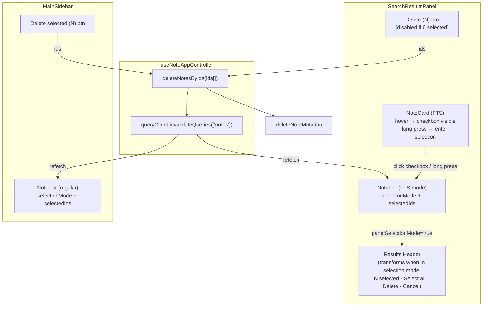

# System Design & Architecture

## Architecture Overview



**Key principle**: Two fully independent selection contexts (search panel + main list), one shared delete operation, one shared cache invalidation that syncs both.

## Data Models

No new data models. Selection state is ephemeral UI state:

```ts
// Local to SearchResultsPanel (new)
const [panelSelectionMode, setPanelSelectionMode] = useState(false)
const [panelSelectedIds, setPanelSelectedIds] = useState<Set<string>>(new Set())
const [panelBulkDeleting, setPanelBulkDeleting] = useState(false)
```

The existing `useNoteSelection` state (in `useNoteAppController`) remains unchanged and drives the main list.

## API Design

No new backend API. The feature reuses:
- `deleteNoteMutation.mutateAsync({ id, silent: true })` — existing Supabase delete
- `enqueueBatchAndDrainIfOnline(...)` — existing offline queue
- `queryClient.invalidateQueries({ queryKey: ['notes'] })` — existing cache invalidation

The controller exposes a generic `deleteNotesByIds(ids: string[])` helper (or the panel calls the mutation directly via controller props) — see Component Breakdown.

## Component Breakdown

### `SearchResultsPanel.tsx` — changes
- Add local state: `panelSelectionMode`, `panelSelectedIds`, `panelBulkDeleting`
- **No "Select" button** — selection mode is entered via card interaction (see NoteCard below)
- Results header transforms when `panelSelectionMode` is true: shows "N selected", "Select all", "Delete (N)" [disabled at 0], "Cancel"
- Pass `selectionMode={panelSelectionMode}` and `selectedIds={panelSelectedIds}` to `NoteList` (FTS path)
- "Delete (N)" calls `controller.deleteNotesByIds(Array.from(panelSelectedIds))` then resets panel state and calls `controller.resetFtsResults()`

### `NoteCard.tsx` — changes
- **Desktop**: when `selectionMode` is false, render checkbox with `opacity-0 group-hover:opacity-100` (top-left corner). Clicking it calls `onToggleSelect` which propagates to panel to enter selection mode.
- **Mobile**: add `useLongPress` hook (pointer events + 500ms timeout) on the card root element; long press triggers `onToggleSelect` → enters selection mode.
- When `selectionMode` is true: checkbox always visible (existing behaviour unchanged).
- Applies to both `compact` and `search` variants.

### `useLongPress.ts` — new hook
- Listens to `onPointerDown` / `onPointerUp` / `onPointerLeave`
- After 500ms threshold fires a callback; cancels on pointer up/leave or movement > threshold
- Used by NoteCard for mobile selection entry

### `useNoteAppController` — minor change
- Expose `deleteNotesByIds(ids: string[]): Promise<void>` — encapsulates delete loop, offline path, toast, `queryClient.invalidateQueries(['notes'])`, `setSelectedNote(null)`
- Expose `resetFtsResults()` (delegated from `useNoteSearch`) for panel to call after delete

### `useNoteBulkActions.ts` — refactor
- `deleteSelectedNotes` becomes a thin wrapper: `await deleteNotesByIds(Array.from(selectedNoteIds))` + `exitSelectionMode()`

### `useNoteSearch.ts` — minor change
- Expose `resetFtsResults()` callback (already planned from earlier session work)

### `NoteList.tsx` — no changes needed
- Already supports `selectionMode`, `selectedIds`, `onToggleSelect` props
- FTS `SearchRow` already renders checkboxes when `selectionMode` is true

## Design Decisions

### Two independent selection contexts (not shared state)
**Decision**: Search panel owns its own `panelSelectionMode`/`panelSelectedIds` state locally. Main list keeps `useNoteSelection` state from the controller.

**Rationale**:
- No valid use case for selecting across both lists simultaneously
- Shared state would require complex conflict resolution (which list's "Exit" button wins? what if same note is in both?)
- Independent contexts are simpler, testable in isolation, and match how users think about the two surfaces

**Alternative considered**: Single global selection mode passed down to both. Rejected due to complexity and confusing UX (selection mode in one place activating checkboxes in another).

### Cache invalidation as the sync mechanism
**Decision**: After deletion, call `queryClient.invalidateQueries({ queryKey: ['notes'] })`. Both `useNotesQuery` (main list, key `['notes', userId, '', null]`) and `useSearchNotes` (FTS, key `['notes', 'search', ...]`) share the `['notes']` prefix and will refetch.

**Rationale**: No custom events, no prop drilling between panels. React Query's cache is the single source of truth; invalidation is the standard pattern.

**FTS accumulated results**: After deletion, reset `ftsOffset` to 0 and clear `ftsAccumulatedResults` in `useNoteSearch` so the repopulation effect does a full replacement with fresh data (no stale deleted notes).

### deleteNotesByIds extracted to controller
**Decision**: Extract the bulk delete core logic from `useNoteBulkActions` into a controller-level helper.

**Rationale**: Both the main list and the search panel need to delete by ID set + handle offline + invalidate cache. Duplicating this in the panel component would violate DRY and create two places to maintain offline logic.

## Non-Functional Requirements

- **Performance**: Bulk delete uses `Promise.allSettled` (parallel requests) — unchanged. Cache invalidation triggers one refetch per active query, not per deleted note.
- **Offline**: Same enqueue path as existing bulk delete.
- **Accessibility**: No dedicated "Select" button — keyboard users enter selection mode by tabbing to a card and pressing Space (checkbox receives focus via `tabIndex`). When selection mode is active, "Cancel" and "Delete" in the header must be keyboard-reachable. Checkboxes already have labels via `NoteCard`.
- **No regression**: Main list selection mode behaviour must be bit-for-bit identical to current.
