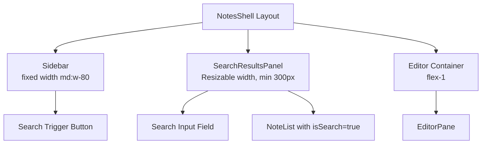

# System Design & Architecture

## Architecture Overview
**What is the high-level system structure?**

We will introduce a new discrete view component, `SearchResultsPanel`, injected into the main `NotesShell` layout between the `Sidebar` and the `EditorPane`.

- **Key components and responsibilities:**
  - `NotesShell`: Orchestrates the conditional rendering of the three panels. Manages responsive layout (hiding sidebar when search or editor is visible on mobile).
  - `Sidebar`: Replaces the actual search input with a trigger button.
  - `SearchResultsPanel`: Houses the real search input and the `NoteList` that renders `search` layout cards. Contains drag-to-resize logic.
  - `useNoteAppController` / `useNoteSearch`: Manages the `isSearchPanelOpen` state alongside the existing `searchQuery`.

## Data Models & State
**What data do we need to manage?**

We need to add UI interaction state. No database schema changes are required.

- **`useNoteSearch` / Controller Additions:**
  - `isSearchPanelOpen`: boolean
  - `setIsSearchPanelOpen(open: boolean)`: function
  - Modifications to `handleSearch`: Should trigger `isSearchPanelOpen = true` automatically.
- **LocalStorage Persistence:**
  - `search-panel-width`: A numerical value (in pixels) saving the user's preferred width of the resizable panel.

## API Design
**How do components communicate?**

- `Sidebar` will receive `onOpenSearch` from the `controller`.
- `SearchResultsPanel` will receive: 
  - `searchQuery`, `onSearch`
  - `ftsData`, `ftsLoading`, `ftsHasMore`, `onLoadMoreFts` 
  - `onClose` to terminate the search session
  - `onSearchResultClick` to open the note without closing the panel.

## Component Breakdown
**What are the major building blocks?**

1. **`NotesShell.tsx`**
   - Modified flex layout.
   - Render: `<Sidebar />`
   - Render: `{isSearchPanelOpen && <SearchResultsPanel />}`
   - Render: `<EditorContainer />`
   - Mobile logic: When `isSearchPanelOpen` is true on mobile, hide `Sidebar` and `Editor`. When `isEditing` or `selectedNote`, hide `SearchPanel` (or render it under a z-index layout).

2. **`SearchResultsPanel.tsx` (New Form Component)**
   - Header with `<Search>` input (auto-focused on mount) and `<X>` close button.
   - On mobile, the close button becomes a `<- Back` button.
   - Uses `NoteList` inside to display results.
   - Includes a custom resize handle (`onPointerDown`, `onPointerMove`) on its right edge to control width. The component will manage a `width` state synchronized with `localStorage`.

3. **`Sidebar.tsx`**
   - Replace `#Search` block with a read-only button or input. When clicked, it calls `onOpenSearch`.
   - Remove search-specific display logic from the regular `NoteList` inside the Sidebar, so the Sidebar only ever displays all notes.

## Design Decisions
**Why did we choose this approach?**

- **Custom Resizer vs `<ResizablePanelGroup>`:** The existing app layout utilizes strict utility classes (e.g. fixed `w-80` for the Sidebar and `flex-1` for the editor). Shadcn's layout based on `react-resizable-panels` uses percentages which would require refactoring the entire `NotesShell` shell sizing. Using a custom drag handle right inside `SearchResultsPanel` allows for a pixel-perfect `min-width/max-width` constraint while leaving `Sidebar` and `Editor` unaffected.
- **Extending the Controller:** Hooking `isSearchPanelOpen` into the existing `useNoteSearch` hook ensures that when other components (like global keyboard shortcuts) trigger a search, the panel knows to open seamlessly.
- **Search clear behavior:** Clearing the query resets search state but keeps the panel open; closing remains explicit via Close/Back controls.

### Post-Implementation Architecture Decisions

- `useNoteAppController` intentionally calls `useNotesQuery` with `searchQuery: ''` for the sidebar list.
  - Rationale: search rendering is owned by `SearchResultsPanel`; the main sidebar list stays stable and does not mirror search results.
  - Trade-off: no 1-2 character inline filtering in sidebar, but avoids duplicate result surfaces and extra query load.
- Full-text search minimum query length is 3 characters.
  - Rationale: PostgreSQL FTS constraints and better signal-to-noise for server queries.
- `useNoteSearch` no longer keeps duplicate query states (`searchQuery` + `ftsSearchQuery`).
  - Rationale: single source of truth; exported API compatibility is kept by returning `ftsSearchQuery` as `searchQuery`.
- `handleSearch` resets `ftsAccumulatedResults` only when the committed (trimmed) query actually changes.
  - Rationale: Enter on the same query should not clear visible results before refetch completes.
- Enter key cancels debounce and forces refresh for both FTS and AI paths when query text is unchanged.
  - Rationale: explicit user submit must always produce a fresh fetch (`ftsSearchResult.refetch()` and `aiRefetch()`).

## Non-Functional Requirements

- **Performance:** Resizing the panel must not cause re-renders of the inner `NoteEditor` document body constantly. We should use CSS transform or fast React state for width adjustment without blocking the main thread.
- **Responsiveness (Mobile):** The "push" layout will break mobile screens. Thus, on mobile, we revert to an exclusive pane approach (visible pane is `w-full`, others `hidden`).
