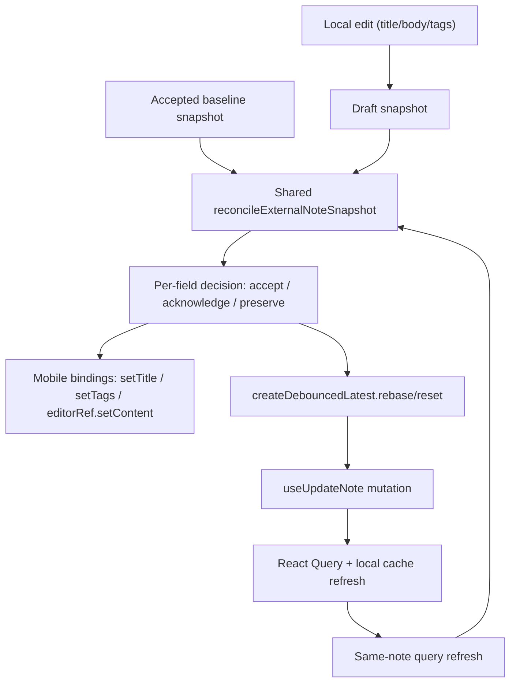

# System Design & Architecture

## Architecture Overview
**What is the high-level system structure?**

- Shared core semantics live in `core/utils/noteAutosaveSession.ts`.
- The same shared autosave session semantics are reused in both clients during this iteration, with symmetric behavior between web and mobile.
- Platform bindings stay separate:
  - mobile applies reconciled fields into React state and `EditorWebView`
  - web keeps its uncontrolled editor bindings but must apply the same reconcile outcomes as mobile for clean vs dirty fields
- Debounced autosave receives a new `rebase` operation so the accepted baseline can move forward after an external refresh without blindly canceling pending local work.

## Data Models
**What data do we need to manage?**

- `DraftSnapshot`
  - `title: string`
  - `description: string`
  - `tags: string[]`
- `baseline`
  - the latest accepted external or acknowledged snapshot for the active note
- `dirty field`
  - a field whose current draft value differs from the accepted baseline for that field
- `fieldDecision`
  - `accept-external`: field is clean locally, so adopt incoming value
  - `acknowledge-local`: incoming value matches dirty local draft, so mark it accepted
  - `preserve-local`: incoming value conflicts with a dirty local field, so keep local draft while advancing baseline
- `dirtyFields`
  - derived by comparing reconciled draft fields against the reconciled baseline

## API Design
**How do components communicate?**

- `resolveNoteAutosaveSessionChange({ previousNoteId, nextNoteId, hasPendingCreateAssignment })`
  - unchanged behavior for real note switches vs autosave ID assignment
- `reconcileExternalNoteSnapshot({ currentNoteId, incomingNoteId, currentDraft, currentBaseline, incomingSnapshot, fields, comparators })`
  - if note ID changed: replace draft and baseline
  - if same note:
    - clean field -> accept incoming into draft and baseline
    - dirty field + incoming matches draft -> acknowledge local draft and advance baseline
    - dirty field + incoming differs -> preserve local draft and still advance baseline
  - this protects the active editing session only; final persisted resolution still follows last-write-wins once the latest write is sent
- `createDebouncedLatest.rebase(base, nextPending?)`
  - updates the debouncer baseline after an external refresh
  - optionally keeps a merged pending draft if one already exists
- `flushPendingUpdates()`
  - if the reconciled draft is still dirty and the debouncer has no pending payload, enqueue the latest draft before flushing
  - prevents blur/unmount from silently skipping a preserved dirty draft

## Component Breakdown
**What are the major building blocks?**

- Core:
  - `core/utils/noteAutosaveSession.ts`
  - `core/utils/debouncedLatest.ts`
- Mobile:
  - `ui/mobile/app/note/[id].tsx`
  - `ui/mobile/hooks/useNotesMutations.ts`
  - `ui/mobile/components/EditorWebView.tsx`
- Web:
  - `ui/web/hooks/useNoteEditorAutoSave.ts`
  - `ui/web/components/features/notes/NoteEditor.tsx`
  - existing uncontrolled editor binding remains platform-specific, but the resulting same-note refresh behavior must match mobile

## Design Decisions
**Why did we choose this approach?**

- Field-level reconciliation is required because autosave patches are partial; whole-snapshot preserve/replace loses legitimate external updates.
- Baseline must track the newest accepted incoming snapshot even when local draft stays dirty, otherwise "dirty" can collapse incorrectly after concurrent external changes.
- The debouncer needs explicit baseline rebasing because same-note refreshes are not true session resets.
- Blur/unmount must flush from the latest reconciled draft, not only from an existing timer, because concurrent same-note refreshes can leave the editor dirty with no pending debounce payload.
- No conflict UI is introduced in this design; preserving a dirty local field is a temporary client-side editing safeguard, not a change to the product's last-write-wins persistence model.
- Web and mobile must be symmetric: for the same note session and the same incoming snapshot, both clients should make the same keep/adopt/acknowledge decision for each tracked field.

Alternatives considered:
- Whole-snapshot `preserve-draft` vs `replace-draft`
  - rejected because it cannot safely handle mixed dirty/clean fields
- Immediate optimistic promotion of local draft to baseline on flush
  - rejected because it makes stale refresh handling and dirty detection race-prone

## Non-Functional Requirements
**How should the system perform?**

- Performance:
  - reconciliation must stay O(number of tracked fields) with no deep editor remount on same-note refresh
- Reliability:
  - pending local drafts must survive same-note refreshes and blur/unmount flows
- Correctness:
  - clean fields should not remain stale after newer external refreshes
  - dirty fields should not be overwritten by stale refetches
- Security:
  - no new network paths or permissions; all writes continue through existing authenticated mutations
