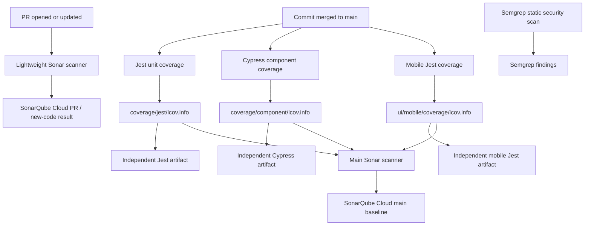

# Sonar Test Coverage Design

## Architecture Overview

GitHub Actions replaces SonarQube Cloud Automatic Analysis. The PR job invokes
only the scanner. The main workflow runs three independent coverage producers
in parallel, downloads their immutable artifacts into a final scanner job, and
passes all LCOV paths explicitly.

## Data Models

- `coverage/jest/lcov.info`: unit-test execution map for `app`, `core`, and
  `ui/web`.
- `coverage/component/lcov.info`: component-test execution map for the same
  production-code scope.
- `ui/mobile/coverage/lcov.info`: Jest execution map for the Expo/mobile source
  and any shared core code exercised by mobile tests.
- `SONAR_TOKEN`: GitHub secret used only by scanner jobs.
- Sonar analysis parameters: cloud host, organization, cloud project key, and
  optional LCOV paths for the main analysis.

## API Design

The Sonar scanner uploads analysis data to `https://sonarcloud.io`. GitHub
Actions provides PR metadata automatically for `pull_request` events. Main
analysis is identified by the checked-out `main` revision.

Coverage producers do not call Sonar directly. The final job is the sole owner
of a main-revision analysis, preventing duplicate or partial uploads.

## Component Breakdown

- `sonar-project.properties` owns cloud identity and stable source/test scope.
- `.github/workflows/sonar.yml` owns event routing, report production, artifact
  transfer, and cloud-specific scanner parameters.
- Jest owns instrumentation for unit coverage and writes `coverage/jest`.
- Babel Istanbul plus `@cypress/code-coverage` own browser instrumentation;
  NYC renders the final independent component report.
- Mobile Jest owns React Native/Expo test instrumentation and writes
  `ui/mobile/coverage`.
- Semgrep remains a separate SAST workflow. Its platform does not import LCOV
  or represent runtime test coverage.

## Design Decisions

### PR analysis remains fast

PR scans run on `opened`, `synchronize`, and `reopened`, matching the effective
Automatic Analysis cadence. They do not install dependencies or run tests.
Coverage is therefore unavailable on ordinary PR analyses by design.

### Main coverage is deterministic

The scanner never relies on implicit discovery of `coverage/lcov.info`.
Producer jobs must create and upload their named LCOV file; the consumer fails
if any report is absent.

### Reports remain independent

Root Jest, Cypress, and mobile Jest retain separate reports, percentages, HTML
output, and artifacts. SonarQube Cloud exposes one coverage measure per project,
so its main metric represents code covered by any configured test layer.
Overlapping lines, including shared core code, are deduplicated and the result
cannot exceed 100 percent. Sonar Measures still allows drill-down by directory,
but not by test runner.

### Cloud identity is the repository default

`sonar-project.properties` uses the identifiers generated by SonarQube Cloud:
project `koreyba_EverFreeNote` and organization `koreyba`. A local scanner must
override `sonar.projectKey=EverFreeNote` and the local host URL. This makes the
committed default match the shared CI service while retaining local diagnostics.

### One product uses multiple TypeScript programs

The repository is one Sonar project because it has one shared PR and Quality
Gate. The scanner uses `tsconfig.json`, `tsconfig.tests.json`, and the
dependency-free `ui/mobile/tsconfig.sonar.json`. The custom mobile analysis
config copies the essential Expo compiler options because PR scanner jobs
intentionally do not install `node_modules`. Root application (`app` and
`ui/web`), shared `core`, and `ui/mobile` are production coverage scope.
Infrastructure and tooling such as Supabase functions and scripts remain
statically analyzed but are excluded from this test-coverage metric until they
have an owned coverage producer.

## Non-Functional Requirements

- All three coverage producers run in parallel so main latency is approximately
  the slowest producer plus scanner time, not the sum of all suites.
- Actions and scanner dependencies are pinned to immutable revisions.
- Untrusted fork code never receives `SONAR_TOKEN`.
- Artifacts are retained for 14 days for diagnosis without becoming permanent
  storage.
- Automatic Analysis must be disabled before the workflow is activated to
  prevent duplicate-analysis rejection.

## References

- [SonarQube Cloud Automatic Analysis](https://docs.sonarsource.com/sonarqube-cloud/advanced-setup/automatic-analysis)
- [JavaScript and TypeScript test coverage](https://docs.sonarsource.com/sonarqube-cloud/enriching/test-coverage/javascript-typescript-test-coverage)
- [JavaScript and TypeScript analysis and TSConfig guidance](https://docs.sonarsource.com/sonarqube-cloud/advanced-setup/languages/javascript-typescript-css)
- [Semgrep CI sample configurations](https://semgrep.dev/docs/semgrep-ci/sample-ci-configs)
