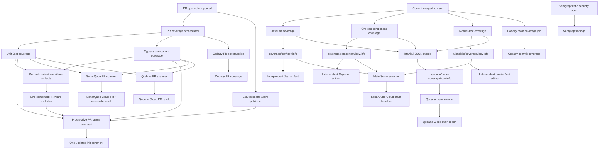
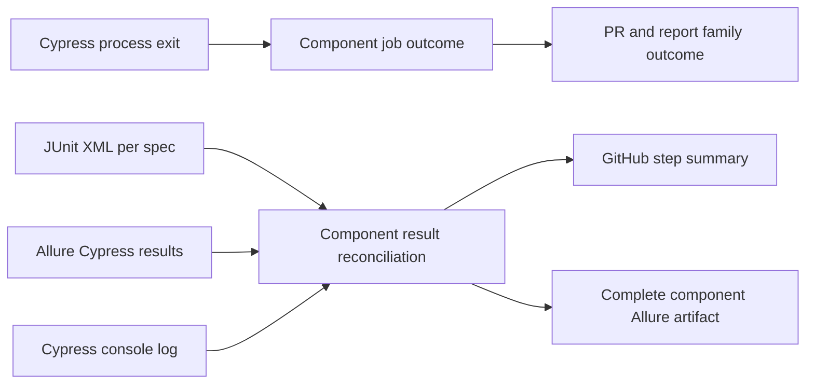

# Sonar and Qodana Analysis and Coverage Design

## Architecture Overview

```mermaid
flowchart TD
  PR["PR opened or updated"] --> PRTests["PR coverage orchestrator"]
  PRTests --> UnitPR["Unit Jest coverage"]
  PRTests --> ComponentPR["Cypress component coverage"]
  UnitPR --> PRArtifacts["Current-run test and Allure artifacts"]
  ComponentPR --> PRArtifacts
  UnitPR --> PRStatus["Progressive PR status comment"]
  ComponentPR --> PRStatus
  PRArtifacts --> AllurePR["One combined PR Allure publisher"]
  AllurePR --> PRStatus
  PR --> E2EPR["E2E tests and Allure publisher"]
  E2EPR --> PRStatus
  PRStatus --> PRComment["One updated PR comment"]
  UnitPR --> PRScan["SonarQube PR scanner"]
  ComponentPR --> PRScan
  UnitPR --> QodanaPR["Qodana PR scanner"]
  ComponentPR --> QodanaPR
  PRScan --> PRCloud["SonarQube Cloud PR / new-code result"]
  QodanaPR --> QodanaPRCloud["Qodana Cloud PR result"]

  Main["Commit merged to main"] --> Unit["Jest unit coverage"]
  Main --> Component["Cypress component coverage"]
  Main --> Mobile["Mobile Jest coverage"]
  Unit --> UnitLCOV["coverage/jest/lcov.info"]
  Component --> ComponentLCOV["coverage/component/lcov.info"]
  Mobile --> MobileLCOV["ui/mobile/coverage/lcov.info"]
  UnitLCOV --> UnitArtifact["Independent Jest artifact"]
  ComponentLCOV --> ComponentArtifact["Independent Cypress artifact"]
  MobileLCOV --> MobileArtifact["Independent mobile Jest artifact"]
  UnitLCOV --> MainScan["Main Sonar scanner"]
  ComponentLCOV --> MainScan
  MobileLCOV --> MainScan
  MainScan --> MainCloud["SonarQube Cloud main baseline"]

  Unit --> QodanaMerge["Istanbul JSON merge"]
  Component --> QodanaMerge
  Mobile --> QodanaMerge
  QodanaMerge --> QodanaLCOV[".qodana/code-coverage/lcov.info"]
  QodanaLCOV --> QodanaScan["Qodana main scanner"]
  QodanaScan --> QodanaCloud["Qodana Cloud main report"]

  PRTests --> CodacyPR["Codacy PR coverage job"]
  CodacyPR --> CodacyPRCloud["Codacy PR coverage"]
  Main --> CodacyMain["Codacy main coverage job"]
  CodacyMain --> CodacyCloud["Codacy commit coverage"]

  Semgrep["Semgrep static security scan"] --> SemgrepCloud["Semgrep findings"]
```

GitHub Actions replaces SonarQube Cloud Automatic Analysis. PR coverage is
orchestrated by `pr-coverage-analysis.yml`: Unit and Component are reusable
coverage producers, `allure-pr-publish.yml` is the sole PR Allure publisher,
and `pr-status-comment.yml` is the sole serialized writer for the shared PR
comment. Publishers return trusted report URLs to that writer instead of
patching the comment directly. SonarQube/Qodana consume the producer artifacts
after the test jobs. The existing `sonar-pr.yml` and `qodana-pr.yml` remain
scanner consumers. On
`main`, `merge-tests-coverage.yml` owns the coverage producers, Codacy upload,
and analysis jobs.

## Data Models

- `coverage/jest/lcov.info`: unit-test execution map for `app`, `core`, and
  `ui/web`.
- `coverage/component/lcov.info`: component-test execution map for the same
  production-code scope.
- `ui/mobile/coverage/lcov.info`: Jest execution map for the Expo/mobile source
  and any shared core code exercised by mobile tests.
- `SONAR_TOKEN`: GitHub secret used only by scanner jobs.
- Sonar analysis parameters: cloud host, organization, cloud project key, and
  optional LCOV paths for the main analysis.
- `QODANA_TOKEN`: GitHub secret used by the PR and post-merge Qodana jobs.
- `.qodana/code-coverage/lcov.info`: one normalized LCOV union consumed by
  Qodana for JS.
- `CODACY_API_TOKEN`: GitHub secret used only by Codacy coverage upload jobs.

## API Design

The Sonar scanner uploads analysis data to `https://sonarcloud.io`. GitHub
Actions provides PR metadata automatically for `pull_request` events. Main
analysis is identified by the checked-out `main` revision.

Coverage producers do not call Sonar directly. The final job is the sole owner
of a main-revision analysis, preventing duplicate or partial uploads.

## Component Breakdown

- `sonar-project.properties` owns cloud identity and stable source/test scope.
- `.github/workflows/sonar-pr.yml` owns Sonar PR analysis and consumes the PR
  coverage artifacts when available.
- `.github/workflows/qodana-pr.yml` owns Qodana PR static analysis and consumes
  the PR coverage artifacts when available.
- `.github/workflows/pr-coverage-analysis.yml` owns PR ordering and passes
  `publish_allure: false` to the reusable test producers. It also starts the
  progressive unit/component status-comment updates.
- `.github/workflows/pr-status-comment.yml` owns serialized updates to the
  single PR status comment after each coverage producer finishes.
- `.github/workflows/allure-pr-publish.yml` owns the single combined PR Allure
  publication and consumes artifacts from the current orchestrator run.
- `.github/workflows/merge-tests-coverage.yml` owns the one-time main coverage
  producers, artifact upload, Codacy main upload, Sonar main analysis, and
  Qodana main analysis.
- `.github/workflows/pr-coverage-analysis.yml` owns the PR coverage producers,
  Codacy PR upload, Sonar PR analysis, and Qodana PR analysis. Codacy is kept as
  a separate job in the same orchestrator, so it does not rerun tests or depend
  on Sonar/Qodana success.
- Jest owns instrumentation for unit coverage and writes `coverage/jest`.
- Babel Istanbul plus `@cypress/code-coverage` own browser instrumentation;
  NYC renders the final independent component report.
- Mobile Jest owns React Native/Expo test instrumentation and writes
  `ui/mobile/coverage`.
- Semgrep remains a separate SAST workflow. Its platform does not import LCOV
  or represent runtime test coverage.
- `scripts/merge-coverage.cjs` owns the Qodana input conversion: it merges the
  three Istanbul JSON maps, normalizes Windows paths, deduplicates overlapping
  files, and keeps the same product coverage scope as Sonar.
- `qodana.yaml` selects `qodana-js` and the recommended profile. The separate
  Qodana PR workflow runs for every supported PR update without coverage, while
  the Qodana main job runs after the coverage producers with the same generated
  artifacts.

## Design Decisions

### PR coverage is ordered and report publication is single-owner

Sonar and Qodana PR scans run on `opened`, `synchronize`, and `reopened`,
after the Unit and Component coverage producers. Producer workflows upload
their own test and coverage artifacts but do not publish Allure when called by
the PR orchestrator. A serialized status updater updates the existing PR
comment after each producer completes. A single publisher then downloads the
current run's Allure artifacts, merges them with any matching external-suite
artifacts, updates GitHub Pages once, and patches the same comment with the
final report link through the serialized status workflow. E2E follows the same
contract. Publishers never read a report-index file into an outbound comment
request; they expose only a validated published URL. This avoids writers
overwriting one another while preserving progressive status visibility and the
existing Allure report format and history model.

### PR analysis remains resilient

Sonar and Qodana use `always()` after the coverage jobs, so a test failure does
not suppress static analysis. Allure publication also runs after both producer
jobs when the PR is trusted and publishes whatever valid result artifacts are
available.

### Main coverage is deterministic

The scanners never rely on implicit discovery of `coverage/lcov.info`.
Producer jobs create and upload named coverage artifacts; Sonar consumes the
three LCOV reports and Qodana consumes the raw reports in separate jobs within
the same workflow run. The Qodana consumer fails if any raw input is absent.

### Reports remain independent

Root Jest, Cypress, and mobile Jest retain separate reports, percentages, HTML
output, and artifacts. SonarQube Cloud exposes one coverage measure per project,
so its main metric represents code covered by any configured test layer.
Overlapping lines, including shared core code, are deduplicated and the result
cannot exceed 100 percent. Sonar Measures still allows drill-down by directory,
but not by test runner.

### Cypress component result sources are layered

```mermaid
flowchart LR
  Cypress["Cypress process exit"] --> Job["Component job outcome"]
  JUnit["JUnit XML per spec"] --> Reconcile["Component result reconciliation"]
  AllureRaw["Allure Cypress results"] --> Reconcile
  Log["Cypress console log"] --> Reconcile
  Reconcile --> Summary["GitHub step summary"]
  Reconcile --> AllureArtifact["Complete component Allure artifact"]
  Job --> PRStatus["PR and report family outcome"]
```

The Cypress process exit code is the source of truth for the component job
outcome. JUnit XML is the structured source of truth for completed spec/test
counts and failures; totals are read once from each top-level `testsuites`
element rather than summed from nested Mocha suites. If retries leave more than
one JUnit file for a spec, only the latest report is canonical. Allure remains
the test-level presentation and history format. A reconciliation step adds a
spec-level broken result only when JUnit or the failed Cypress process has no
corresponding failed/broken Allure result. The console summary is not a
canonical result source because terminal-width wrapping can split long spec
paths; it is retained only for diagnostic text and compatibility fallback.

### Qodana receives the Sonar-equivalent union

Qodana for JS accepts one LCOV report per analysis, while Sonar accepts the
three producer reports directly. The Qodana job therefore merges the raw
Istanbul JSON maps before generating LCOV. The merge is a union of execution
counts for the same normalized project-relative file, not an average of the
three producer percentages. The Qodana quality gate does not set an arbitrary
percentage threshold, matching Sonar's current measurement-only behavior.

### Codacy consumes independent LCOV reports

Codacy receives the producer LCOV files directly, one report per test layer,
from jobs in the same main and PR orchestrator workflows as Sonar and Qodana.
The Coverage Reporter associates every upload with the checked-out commit SHA.
The main consumer uploads root Jest, Cypress, and mobile Jest reports. The PR
consumer uploads the core Jest, web Jest, mobile Jest, and Cypress reports from
the current PR run. Codacy deduplicates overlapping covered lines and uses the
head commit plus the common ancestor to calculate pull-request coverage
variation.

### Cloud identity is the repository default

`sonar-project.properties` uses the identifiers generated by SonarQube Cloud:
project `koreyba_EverFreeNote` and organization `koreyba`. A local scanner must
override `sonar.projectKey=EverFreeNote` and the local host URL. This makes the
committed default match the shared CI service while retaining local diagnostics.

### One product uses multiple TypeScript programs

The repository is one Sonar project because it has one shared PR and Quality
Gate. The scanner uses `tsconfig.json`, `tsconfig.tests.json`, and the
dependency-free `ui/mobile/tsconfig.sonar.json`. The custom mobile analysis
config copies the essential Expo compiler options because PR scanner jobs
intentionally do not install `node_modules`. Root application (`app` and
`ui/web`), shared `core`, and `ui/mobile` are production coverage scope.
Infrastructure and tooling such as Supabase functions and scripts remain
statically analyzed but are excluded from this test-coverage metric until they
have an owned coverage producer.

## Non-Functional Requirements

- All three coverage producers run in parallel so main latency is approximately
  the slowest producer plus scanner time, not the sum of all suites.
- Actions and scanner dependencies are pinned to immutable revisions.
- Untrusted fork code never receives `SONAR_TOKEN`.
- Artifacts are retained for 14 days for diagnosis without becoming permanent
  storage.
- Automatic Analysis must be disabled before the workflow is activated to
  prevent duplicate-analysis rejection.

## References

- [SonarQube Cloud Automatic Analysis](https://docs.sonarsource.com/sonarqube-cloud/advanced-setup/automatic-analysis)
- [JavaScript and TypeScript test coverage](https://docs.sonarsource.com/sonarqube-cloud/enriching/test-coverage/javascript-typescript-test-coverage)
- [JavaScript and TypeScript analysis and TSConfig guidance](https://docs.sonarsource.com/sonarqube-cloud/advanced-setup/languages/javascript-typescript-css)
- [Semgrep CI sample configurations](https://semgrep.dev/docs/semgrep-ci/sample-ci-configs)
