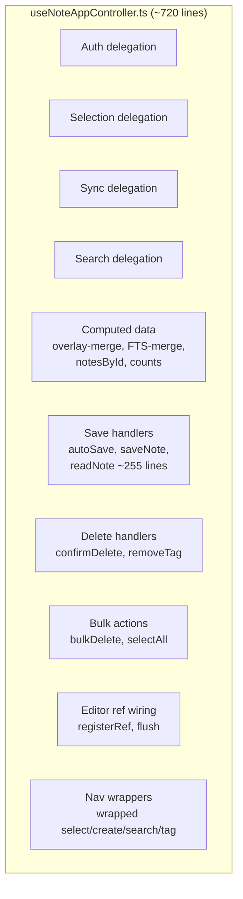
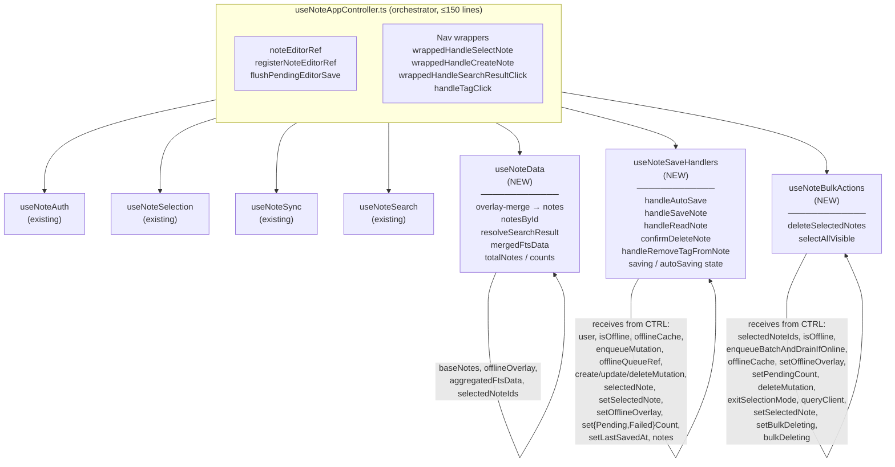

# System Design & Architecture

## Architecture Overview
**What is the high-level system structure?**

### Before (current)



### After (target)



## Data Models
**What data do we need to manage?**

No data model changes. All types (`NoteViewModel`, `NoteInsert`, `NoteUpdate`, `CachedNote`, `MutationQueueItemInput`) remain the same. The refactor is purely structural.

### Shared state ownership (unchanged)

| State | Owned by | Passed to |
|---|---|---|
| `offlineOverlay` / `setOfflineOverlay` | `useNoteSync` | `useNoteData`, `useNoteSaveHandlers`, `useNoteBulkActions` |
| `selectedNote` / `setSelectedNote` | `useNoteSelection` | `useNoteSaveHandlers`, `useNoteBulkActions` |
| `pendingCount` / `setPendingCount` | `useNoteSync` | `useNoteSaveHandlers`, `useNoteBulkActions` |
| `failedCount` / `setFailedCount` | `useNoteSync` | `useNoteSaveHandlers` |
| `lastSavedAt` / `setLastSavedAt` | `useNoteSync` | `useNoteSaveHandlers`, nav wrappers |
| `isOffline` | `useNoteSync` | `useNoteSaveHandlers`, `useNoteBulkActions` |
| `bulkDeleting` / `setBulkDeleting` | `useNoteSelection` | `useNoteBulkActions` |
| `isEditing` / `setIsEditing` | `useNoteSelection` | nav wrappers |

## API Design
**How do components communicate?**

Each new hook is a standard React custom hook that receives dependencies as typed parameters and returns handlers/state.

### `useNoteData(params)` signature (proposed)

```ts
type UseNoteDataParams = {
  notesQuery: ReturnType<typeof useNotesQuery>
  offlineOverlay: CachedNote[]
  aggregatedFtsData: AggregatedFtsData | undefined
  selectedNoteIds: Set<string>
  showFTSResults: boolean
}

// Returns:
{
  notes: NoteViewModel[]
  notesById: Map<string, NoteViewModel>
  resolveSearchResult: (note: SearchResult) => SearchResult
  mergedFtsData: AggregatedFtsData | undefined
  totalNotes: number
  notesDisplayed: number
  notesTotal: number
  selectedCount: number
  notesRef: React.MutableRefObject<NoteViewModel[]>
}
```

### `useNoteSaveHandlers(params)` signature (proposed)

```ts
type UseNoteSaveHandlersParams = {
  user: User | null
  isOffline: boolean
  offlineCache: OfflineCache
  enqueueMutation: EnqueueMutation
  offlineQueueRef: React.MutableRefObject<OfflineQueue>
  createNoteMutation: CreateNoteMutation
  updateNoteMutation: UpdateNoteMutation
  selectedNote: NoteViewModel | null
  selectedNoteRef: React.MutableRefObject<NoteViewModel | null>
  setSelectedNote: SetSelectedNote
  setOfflineOverlay: SetOfflineOverlay
  setPendingCount: SetPendingCount
  setFailedCount: SetFailedCount
  setLastSavedAt: SetLastSavedAt
  notes: NoteViewModel[]
  notesRef: React.MutableRefObject<NoteViewModel[]>
  noteToDelete: NoteViewModel | null
  setDeleteDialogOpen: (open: boolean) => void
  setNoteToDelete: (note: NoteViewModel | null) => void
  setIsEditing: (editing: boolean) => void
}

// Returns:
{
  saving: boolean
  autoSaving: boolean
  handleAutoSave: (data: AutoSaveData) => Promise<void>
  handleSaveNote: (data: SaveData) => Promise<void>
  handleReadNote: (data: SaveData) => Promise<void>
  confirmDeleteNote: () => Promise<void>
  handleRemoveTagFromNote: (noteId: string, tag: string) => Promise<void>
}
```

### `useNoteBulkActions(params)` signature (proposed)

```ts
type UseNoteBulkActionsParams = {
  selectedNoteIds: Set<string>
  isOffline: boolean
  enqueueBatchAndDrainIfOnline: EnqueueBatch
  offlineCache: OfflineCache
  setOfflineOverlay: SetOfflineOverlay
  setPendingCount: SetPendingCount
  deleteNoteMutation: DeleteNoteMutation
  exitSelectionMode: () => void
  queryClient: QueryClient
  setSelectedNote: SetSelectedNote
  setBulkDeleting: (deleting: boolean) => void
  bulkDeleting: boolean
  showFTSResults: boolean
  mergedFtsData: AggregatedFtsData | undefined
  notes: NoteViewModel[]
  selectAllVisibleCallback: (source: NoteViewModel[] | SearchResult[]) => void
}

// Returns:
{
  deleteSelectedNotes: () => Promise<void>
  selectAllVisible: () => void
}
```

## Component Breakdown
**What are the major building blocks?**

| File | Lines (est.) | Responsibility |
|---|---|---|
| `useNoteAppController.ts` | ~120 | Orchestration: mount sub-hooks, wire deps, return unified API |
| `useNoteData.ts` | ~60 | Derived/computed note data |
| `useNoteSaveHandlers.ts` | ~280 | All write handlers (auto-save, manual save, delete, tag removal) |
| `useNoteBulkActions.ts` | ~80 | Bulk delete + selectAllVisible |

All files live in `ui/web/hooks/`.

## Design Decisions
**Why did we choose this approach?**

### Decision 1: Dependency injection via parameters (not context)
**Chosen:** Pass shared state as parameters to sub-hooks.
**Rejected:** New React context. Contexts add indirection and make the data flow less explicit. Since this is controller-layer code (not component-tree-wide), parameter passing keeps the flow traceable.

### Decision 2: `notesRef` and `selectedNoteRef` live in the orchestrator
Both refs are created in `useNoteAppController` and passed to `useNoteSaveHandlers`. This avoids circular dependency (`useNoteData` produces `notes`, `useNoteSaveHandlers` reads `notesRef`).

### Decision 3: Nav wrappers stay in orchestrator
`wrappedHandleSelectNote`, `wrappedHandleCreateNote`, `wrappedHandleSearchResultClick`, `handleTagClick` combine editor-flush + selection + sync resets. They are glue code that belongs in the orchestrator, not in any single sub-hook.

### Decision 4: `confirmDeleteNote` goes in `useNoteSaveHandlers`
Single-note deletion has identical offline/online branching to save handlers and uses the same parameters (`enqueueMutation`, `offlineCache`, `setOfflineOverlay`). Grouping all write operations together gives the hook a coherent "write operations" identity.

### Decision 5: No behaviour changes
This is a pure structural refactor. Any logic changes (e.g. deduplicating autosave vs. manual-save offline paths) are out of scope.

## Non-Functional Requirements
**How should the system perform?**

- **Bundle size:** No impact — tree-shaking is unchanged
- **Runtime performance:** No impact — same hooks, same memoisation, same deps
- **Developer experience:** Each file ≤ 300 lines, single responsibility, independently testable
