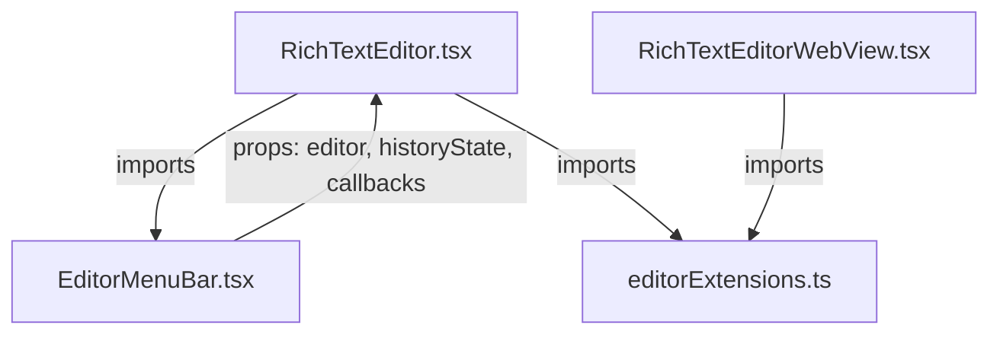

# System Design & Architecture

## Architecture Overview



## Component Breakdown

### editorExtensions.ts (NEW)

- Module-level `const editorExtensions: Extensions` — identical content currently duplicated in both editors
- No React, no hooks — pure TipTap config
- Eliminates duplication: both editors replace their `useMemo(() => [...], [])` with this const

```typescript
// ui/web/components/editorExtensions.ts
import StarterKit from "@tiptap/starter-kit"
// ... all TipTap extension imports
export const editorExtensions: Extensions = [
  StarterKit.configure({ ... }),
  ...
]
```

### EditorMenuBar.tsx (NEW)

- Exports: `HistoryState` type, `EditorMenuBarProps` type, `EditorMenuBar` component
- Receives all data via props — zero internal state, zero hooks (pure presentation)
- Moves: all lucide icon imports, Popover, TwitterPicker, Select, Tooltip imports
- Moves: `fontFamilies`, `fontSizes` constants
- `addImage` helper function moves inside the component

```typescript
// ui/web/components/EditorMenuBar.tsx
export type HistoryState = { canUndo: boolean; canRedo: boolean }
type EditorMenuBarProps = {
  editor: Editor | null
  historyState: HistoryState
  onUndo: () => void
  onRedo: () => void
  hasSelection: boolean
  onApplyMarkdown: () => void
}
export const EditorMenuBar = (props: EditorMenuBarProps) => { ... }
```

### RichTextEditor.tsx (AFTER)

- ~200 lines (down from 764)
- Keeps: `RichTextEditorHandle`, `RichTextEditorProps`, editor lifecycle logic
- Imports: `EditorMenuBar`, `HistoryState` from `./EditorMenuBar`; `editorExtensions` from `./editorExtensions`
- Removes: entire `MenuBar` function, all toolbar imports, `fontFamilies`, `fontSizes`
- Keeps internal: `EMPTY_HISTORY_STATE`, `areHistoryStatesEqual`, `getHistoryState` (only used here)

### RichTextEditorWebView.tsx (MINOR UPDATE)

- Remove `editorExtensions` `useMemo` block
- Import `editorExtensions` from `./editorExtensions`
- Pass directly to `useEditor({ extensions: editorExtensions, ... })`

## Design Decisions

| Decision | Rationale |
|---|---|
| `HistoryState` type lives in `EditorMenuBar.tsx` | It's the contract of the menu bar's props — co-location makes sense |
| Module-level const for extensions | Extension objects are stateless config; module-level const is simpler and more performant than `useMemo` |
| Flat directory (no `editor/` subfolder) | Both new files have one consumer each at the same level — no need for a new folder |
| Keep `EMPTY_HISTORY_STATE` etc. in `RichTextEditor.tsx` | These helpers manage the editor's internal `historyState` — not toolbar concerns |
