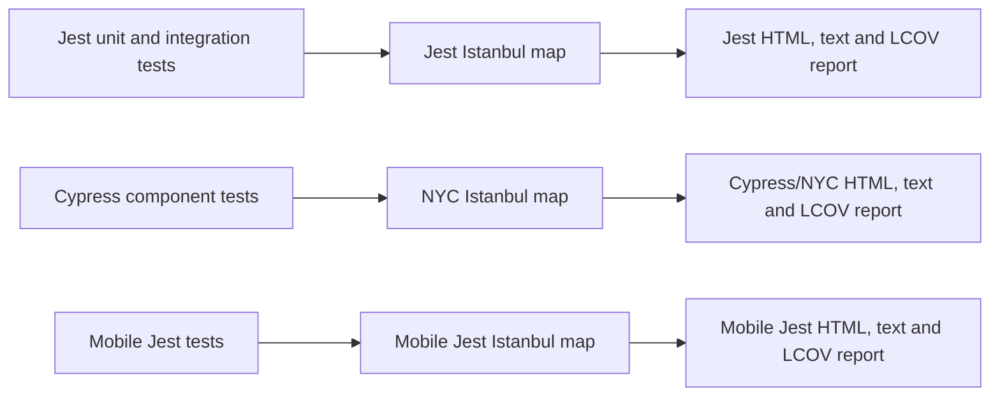

# Test Coverage Architecture

## Decision

The repository has three independent coverage producers and reporting layers:

Root Jest is authoritative for core and web unit/integration behavior. Cypress
is authoritative for browser-rendered component and interaction behavior.
Mobile Jest is authoritative for React Native/Expo behavior. Their percentages
are intentionally not added or averaged.

## Instrumentation ownership

- `babel-jest` instruments code when Jest receives `--coverage`.
- Babel does not add Istanbul for the generic `test` environment.
- Cypress sets `BABEL_ENV=cypress-coverage` only for coverage runs, and the
  Babel config adds Istanbul in that environment.
- A single test process therefore has exactly one Istanbul instrumentation
  owner.

## Coverage scope and quality goal

The measured product scope is root web (`app/**` and `ui/web/**`), shared
`core/**`, and `ui/mobile/**`, excluding declarations and test files. Producer
percentages remain independent. Coverage is initially visible without becoming
a pull-request merge gate; a new-code threshold can be adopted later after the
baseline is stable.

Sonar consumes all LCOV files to produce a derived project-level view: code
covered by at least one test layer. Overlapping lines are not counted twice, so
this union cannot exceed 100 percent. It does not replace producer reports.

## Operational commands

- `npm run test:unit:coverage` writes the Jest report to `coverage/jest`.
- `npm run test:component:coverage` writes Cypress maps to `.nyc_output`.
- `npm run coverage:component` renders the Cypress map to
  `coverage/component`.
- `npm --prefix ui/mobile run test:coverage` writes mobile Jest coverage to
  `ui/mobile/coverage`.

Coverage directories are generated artifacts. CI runs on a clean checkout, so
no preparation script is required. If a local Cypress coverage rerun must be
isolated from an interrupted run, remove `.nyc_output` and
`coverage/component` manually before starting it.

CI publishes all reports separately. Only a successful `main` coverage run
feeds all three files to SonarQube Cloud.
