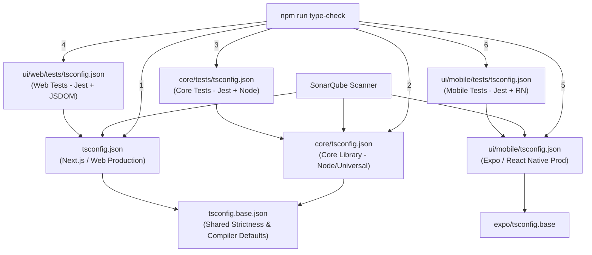

# System Design & Architecture - TSConfig Architecture Setup

## Architecture Overview
**What is the high-level system structure?**

The TypeScript configuration architecture establishes clean project boundaries by creating a base inheritance model and dedicated scoped configuration files for each runtime environment and test suite:

## Component Breakdown

### 1. Base Configuration (`tsconfig.base.json`)
- **Location:** Project root.
- **Responsibility:** Single source of truth for TypeScript compiler strictness (`strict: true`, `skipLibCheck: true`, `esModuleInterop: true`, `forceConsistentCasingInFileNames: true`, `isolatedModules: true`, `resolveJsonModule: true`, `allowSyntheticDefaultImports: true`).

### 2. Core Library (`core/tsconfig.json` & `core/tests/tsconfig.json`)
- **`core/tsconfig.json`:** Extends `tsconfig.base.json`. Target: `ESNext`. Includes `core/**/*.ts` (excluding `core/tests`). Path aliases: `@core/*` -> `./*`.
- **`core/tests/tsconfig.json`:** Extends `../tsconfig.json`. Includes `"types": ["jest", "node"]`. Includes `core/tests/**/*.ts`.

### 3. Web UI (`tsconfig.json` & `ui/web/tests/tsconfig.json`)
- **`tsconfig.json`:** Root Next.js configuration. Extends `tsconfig.base.json`. Includes Next.js types, JSX `react-jsx`, DOM libs. Excludes `ui/mobile`, `core/tests`, `ui/web/tests`.
- **`ui/web/tests/tsconfig.json`:** Extends `../../../tsconfig.json`. Includes `"types": ["jest", "node"]`. Includes `ui/web/tests/**/*.ts`, `ui/web/tests/**/*.tsx`.

### 4. Mobile UI (`ui/mobile/tsconfig.json` & `ui/mobile/tests/tsconfig.json`)
- **`ui/mobile/tsconfig.json`:** Extends `"expo/tsconfig.base"`. Excludes `node_modules` and `tests/`. Removes `"types": ["jest"]`.
- **`ui/mobile/tests/tsconfig.json`:** Extends `../tsconfig.json`. Includes `"types": ["jest"]`. Includes `tests/**/*.ts`, `tests/**/*.tsx`.

### 5. SonarQube & CI Integration
- `.github/workflows/sonar.yml`: Add `npm ci --ignore-scripts` and `npm --prefix ui/mobile ci --ignore-scripts` in Sonar scan steps.
- `sonar-project.properties`: Set `sonar.typescript.tsconfigPaths=tsconfig.json,core/tsconfig.json,ui/mobile/tsconfig.json`.
- Delete `ui/mobile/tsconfig.sonar.json`.

### 6. CLI Type Checking (`package.json`)
- Sequential script execution for `npm run type-check`:
  `tsc --noEmit && tsc -p core/tsconfig.json --noEmit && tsc -p core/tests/tsconfig.json --noEmit && tsc -p ui/web/tests/tsconfig.json --noEmit && npm --prefix ui/mobile run type-check && tsc -p ui/mobile/tests/tsconfig.json --noEmit`

## Design Decisions

| Decision | Rationale | Alternatives Considered |
|---|---|---|
| Use `tsconfig.base.json` | Avoids repeating strict compiler settings in 6 separate files. | Duplicating options in every file (error-prone). |
| Sequential CLI scripts (Option 1) | Zero risk of breaking Next.js/Expo bundlers. Guaranteed isolated type checks. | TS Solution References (`tsc -b`), which requires `"composite": true` and can interfere with Expo Metro or Turbopack. |
| Delete `tsconfig.sonar.json` & update Sonar CI | Eliminates split source-of-truth and ensures Sonar analyzes production-identical configs. | Keeping `tsconfig.sonar.json` (duplicates configs and leads to drift). |
