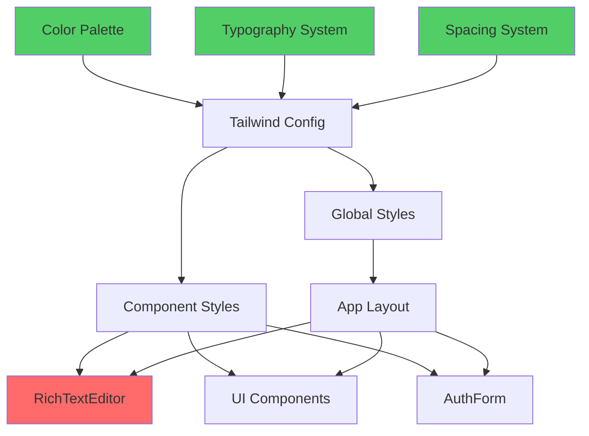

# System Design & Architecture

## Architecture Overview
**What is the high-level system structure?**



**Key components:**
- **Tailwind Config** - центральная точка для определения дизайн-токенов
- **Global Styles** - базовые стили приложения (globals.css)
- **RichTextEditor** - критический компонент, требующий наибольшего внимания
- **UI Components** - shadcn/ui компоненты (buttons, inputs, cards, etc.)
- **AuthForm** - форма аутентификации
- **Color Palette** - определенная цветовая схема на основе Evernote

**Technology stack:**
- Next.js 15.5.6 (App Router)
- Tailwind CSS 4.1.14
- React 19
- shadcn/ui components (Radix UI primitives)
- Tiptap editor 3.7.2
- @tailwindcss/typography 0.5.19

## Data Models
**What data do we need to manage?**

Эта фича не требует изменений в data models - только визуальные изменения.

## API Design
**How do components communicate?**

Нет изменений в API - только стилизация существующих компонентов.

## Component Breakdown
**What are the major building blocks?**

### 1. Design Tokens (Tailwind v4 @theme)
**Файл:** `app/globals.css`

**ВАЖНО:** Проект использует Tailwind CSS v4 с новым синтаксисом `@theme` в CSS, а не в JS config!

**Изменения:**
- Обновить CSS custom properties в `@theme` блоке
- Использовать oklch() цветовое пространство (уже используется в проекте)
- Изменить primary colors на зеленую палитру (Evernote-style)
- Обновить accent colors для лучшей контрастности

**Цветовая палитра (на основе Evernote):**
```css
@theme {
  /* Primary - зеленый как у Evernote */
  --color-primary: oklch(55% 0.15 145); /* Зеленый */
  --color-primary-foreground: oklch(100% 0 0); /* Белый текст */
  
  /* Accent - для интерактивных элементов */
  --color-accent: oklch(96% 0.01 145); /* Светло-зеленый */
  --color-accent-foreground: oklch(30% 0.05 145); /* Темно-зеленый текст */
  
  /* Muted - для второстепенных элементов */
  --color-muted: oklch(96% 0.005 264);
  --color-muted-foreground: oklch(54% 0.016 257);
  
  /* Остальные цвета остаются без изменений */
}
```

**Примечание:** В Tailwind v4 нет `tailwind.config.js` для цветов - все через CSS custom properties!

### 2. Global Styles
**Файл:** `app/globals.css`

**Изменения:**
- Базовые стили для body, html
- Typography defaults
- Focus states
- Selection colors
- Scrollbar styling

### 3. RichTextEditor Component
**Файл:** `components/RichTextEditor\.tsx`

**Критические проблемы для исправления:**
- ❌ Текст не виден → добавить правильный color
- ❌ Кнопки не видны → добавить контрастные стили для toolbar
- ❌ Нет визуального feedback для активных кнопок

**Дизайн решения:**
- Toolbar: светлый фон с border, темные иконки
- Active state: зеленый background для активных кнопок
- Text area: белый фон, темный текст (#1f2937)
- Placeholder: серый текст (#9ca3af)
- Focus state: зеленый border

### 4. UI Components (shadcn/ui)
**Файлы:** `components/ui/*\.tsx`

**Компоненты для аудита:**
- Button - проверить все варианты (primary, secondary, ghost)
- Input - контрастность, focus states
- Card - shadows, borders, spacing
- Badge - цвета для тегов
- Dialog/Alert - модальные окна

### 5. AuthForm Component
**Файл:** `components/AuthForm\.tsx`

**Проверить:**
- Контрастность текста на темном фоне
- Видимость кнопок
- Focus states для inputs

### 6. Layout Components
**Файлы:** `app/layout.tsx`, `app/page.tsx`

**Проверить:**
- Sidebar styling
- Header/navigation
- Общая структура и spacing

## Design Decisions
**Why did we choose this approach?**

**Decision 1: Использовать Tailwind для всех стилей**
- **Rationale:** Уже используется в проекте, обеспечивает consistency
- **Alternatives:** CSS Modules, Styled Components
- **Trade-offs:** Меньше гибкости, но больше согласованности

**Decision 2: Централизовать цвета в tailwind.config.js**
- **Rationale:** Single source of truth для всех цветов
- **Benefits:** Легко менять глобально, подготовка к темной теме
- **Pattern:** Design tokens approach

**Decision 3: Минимальные изменения в структуре компонентов**
- **Rationale:** Снизить риск поломки функциональности
- **Approach:** Только className changes, никаких структурных изменений

**Decision 4: Evernote-inspired, но не копия**
- **Rationale:** Взять лучшие практики, но адаптировать под наш функционал
- **Focus:** Чистота, читаемость, профессионализм

## Non-Functional Requirements
**How should the system perform?**

**Performance:**
- CSS bundle size не должен увеличиться более чем на 10%
- Время рендеринга компонентов не должно измениться
- Использовать Tailwind purge для удаления неиспользуемых стилей

**Accessibility:**
- WCAG AA compliance для контрастности (минимум 4.5:1 для текста)
- Focus states должны быть видимы
- Keyboard navigation не должна пострадать

**Browser compatibility:**
- Поддержка современных браузеров (Chrome, Firefox, Safari, Edge)
- Graceful degradation для старых браузеров

**Maintainability:**
- Документировать цветовую палитру
- Использовать semantic naming для цветов
- Комментарии в tailwind.config.js для важных решений

