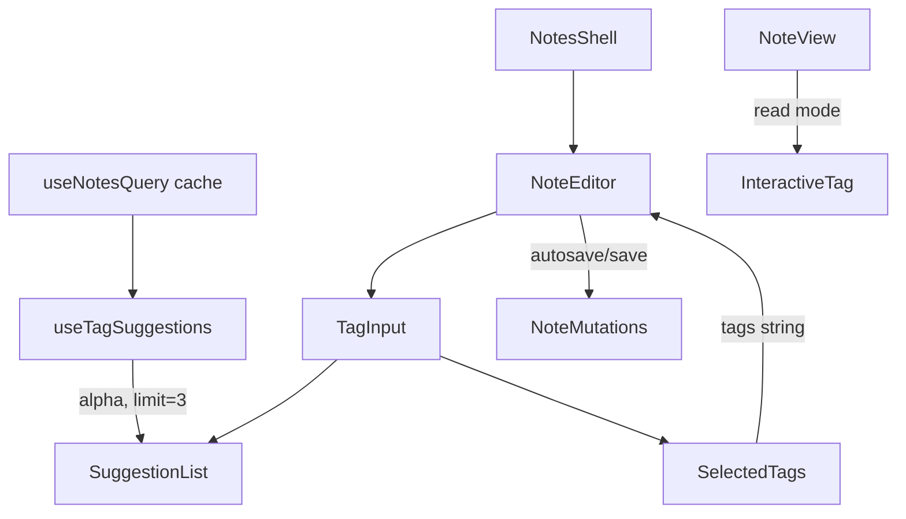

# System Design & Architecture

## Architecture Overview
**What is the high-level system structure?**

- UI-only change in the web app; no backend or schema changes.
- Tag suggestions are derived from existing notes in the local React Query cache.
- New tag input UI replaces the current comma-separated input in edit mode.
- Read mode keeps the existing remove controls for tags.

## Data Models
**What data do we need to manage?**

- Tags remain `string[]` on the note model; editor still persists a comma-separated string for saves.
- Derived tag list: unique tag strings aggregated from loaded notes.
- Tag suggestion view model: `string[]` filtered by prefix, sorted alphabetically.

## API Design
**How do components communicate?**

- No new API endpoints.
- Tag suggestions are computed client-side from existing notes in cache.
- Existing note save/update flows continue to accept `tags: string[]`.

## Component Breakdown
**What are the major building blocks?**

- `ui/web/components/features/notes/NoteEditor.tsx`: replace tags input with a tag chip editor + suggestion list.
- `ui/web/components/InteractiveTag.tsx`: reuse for chip rendering in edit mode to match read mode.
- `ui/web/components/features/notes/NoteView.tsx`: keep tag removal controls as they exist today.
- `ui/web/hooks/useTagSuggestions.ts` (new): derive tag suggestions from cached notes.
- `ui/web/hooks/useNoteAppController.ts`: pass available tag data (if needed) to editor.

## Design Decisions
**Why did we choose this approach?**

- Use local notes cache to avoid new backend dependencies; trade-off is suggestions limited to loaded notes.
- Sort suggestions alphabetically.
- Normalize tags for matching/dup prevention using trimmed lowercase tokens and collapsed spaces.
- Keep tags persistence compatible by emitting a comma-separated string to existing save/autosave handlers.
- Add tags via comma or Enter to preserve keyboard-first workflow.
- Store normalized tags (trim, collapse spaces, lowercase) when a note is edited/saved; no global migration.
- Limit suggestions to 3 items, prefix-only match, and exclude already selected tags to reduce noise.
- Preserve the existing remove controls in read mode; do not disable them as part of this feature.

## Non-Functional Requirements
**How should the system perform?**

- Suggestion filtering and sorting must be fast for large tag sets (memoize filtering and sorting).
- No additional network calls; UI remains responsive while typing.
- Maintain existing sanitization and save/error handling; no new security surface.
