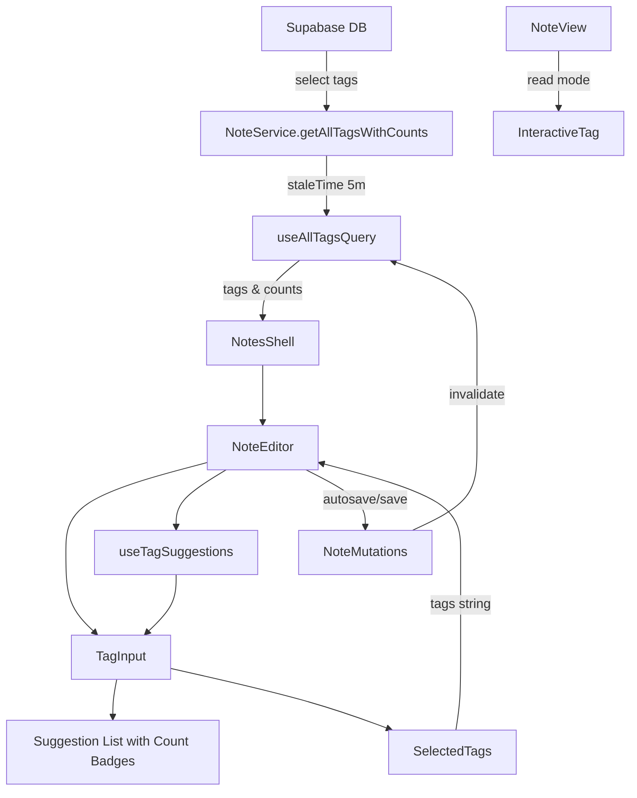

# System Design & Architecture

## Architecture Overview
**What is the high-level system structure?**

- UI & query enhancement; tag counts and suggestions cover 100% of user notes in the database.
- Dedicated lightweight query (`useAllTagsQuery`) fetches tag counts across all database notes without network overhead on keystrokes.
- Tag suggestions are derived synchronously from global tag cache and include count badges.
- New tag input UI replaces the current comma-separated input in edit mode.
- Read mode keeps the existing remove controls for tags.

```mermaid
graph TD
  SupabaseDB[Supabase DB] -->|select tags| NoteService[NoteService.getAllTagsWithCounts]
  NoteService -->|staleTime 5m| UseAllTagsQuery[useAllTagsQuery]
  UseAllTagsQuery -->|tags & counts| NotesShell
  NotesShell --> NoteEditor
  NoteEditor --> TagInput
  NoteEditor --> TagSuggestions[useTagSuggestions]
  TagSuggestions --> TagInput
  TagInput --> SuggestionList[Suggestion List with Count Badges]
  TagInput --> SelectedTags
  SelectedTags -->|tags string| NoteEditor
  NoteEditor -->|autosave/save| NoteMutations
  NoteMutations -->|invalidate| UseAllTagsQuery
  NoteView -->|read mode| InteractiveTag
```

## Data Models
**What data do we need to manage?**

- Tags remain `string[]` on the note model; editor still persists a comma-separated string for saves.
- Global tag count map: `Record<string, number>` mapping normalized tag string to its total occurrence count across all user notes.
- Tag suggestion view model: `string[]` filtered by prefix, sorted alphabetically, with optional `tagCounts` for count badge rendering.

## API Design
**How do components communicate?**

- `NoteService.getAllTagsWithCounts(userId)` executes `select('tags').eq('user_id', userId)` to retrieve tag arrays across all user notes.
- Communicates via React Query key `['tags', 'all-with-counts', userId]`.
- Keeps zero network requests during typing; autocomplete query filtering stays 100% client-side.

## Component Breakdown
**What are the major building blocks?**

- `core/services/notes.ts`: `getAllTagsWithCounts` aggregates global tags and counts.
- `ui/web/hooks/useNotesQuery.ts`: `useAllTagsQuery` manages the global tag cache with 5-minute `staleTime`.
- `ui/web/hooks/useNotesMutations.ts`: invalidates global tag query key on note create/update/delete/removeTag.
- `ui/web/components/features/notes/NoteEditor.tsx`: renders tag chips, input field, and suggestion dropdown with counts.
- `ui/web/components/TagInput.tsx`: renders tag chips, input, and suggestion listbox with count badges.

## Design Decisions
**Why did we choose this approach?**

- Fetch global tags/counts in a single lightweight query to ensure 100% accurate count badges (e.g. 4 notes) across all paginated notes.
- Keep keystroke matching synchronous and local in React memory to prevent network latency while typing.
- Sort suggestions alphabetically.
- Display count badges alongside suggestions (`Travel` **5**).
- Normalize tags for matching/dup prevention using trimmed lowercase tokens and collapsed spaces.
- Keep tags persistence compatible by emitting a comma-separated string to existing save/autosave handlers.
- Add tags via comma or Enter to preserve keyboard-first workflow.
- Commit a pending tag on save, blur, or when leaving the note (autosave can include it).
- Store normalized tags (trim, collapse spaces, lowercase) when a note is edited/saved; no global migration.
- Limit suggestions to 3 items, prefix-only match, and exclude already selected tags to reduce noise.
- Require a double-backspace to remove the last tag when the input is empty.
- Tag input changes do not trigger autosave; only title/body edits can.
- Always show tag remove icons on mobile viewport (no hover requirement).
- Preserve the existing remove controls in read mode; do not disable them as part of this feature.

## Non-Functional Requirements
**How should the system perform?**

- Suggestion filtering and sorting must be fast for large tag sets (memoize filtering and sorting).
- No additional network calls; UI remains responsive while typing.
- Maintain existing sanitization and save/error handling; no new security surface.
