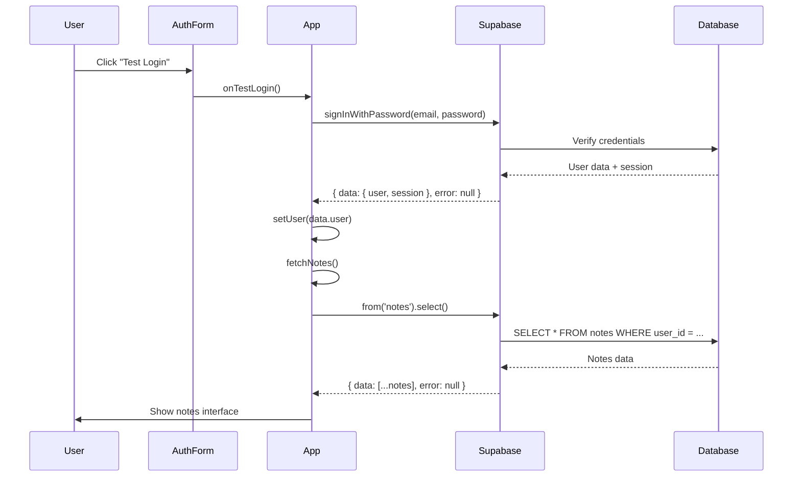
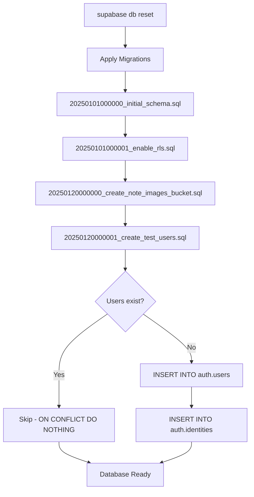
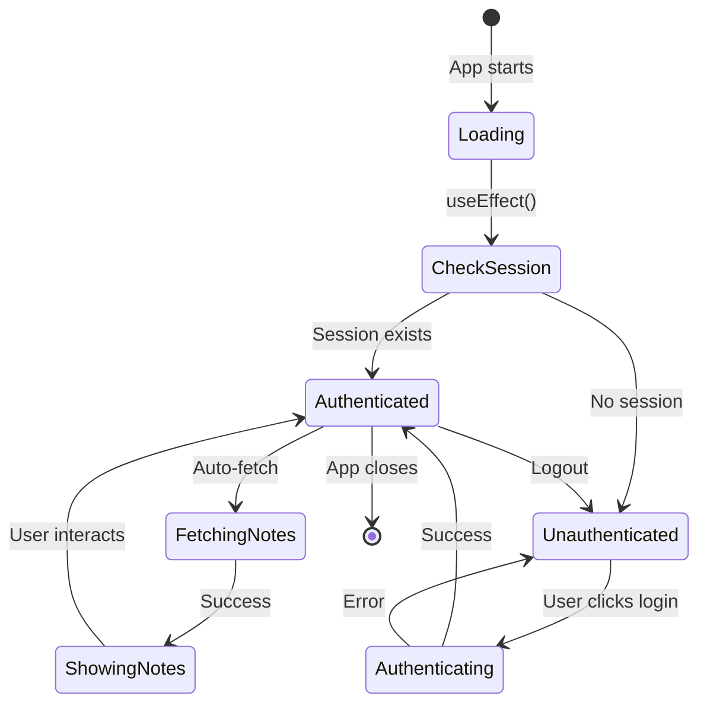

# Knowledge: User Authentication Flow

**Analysis Date:** 2025-01-20  
**Depth:** 3 levels  
**Entry Point:** `app/page.tsx` → Authentication logic  
**Related Files:** `components/AuthForm\.tsx`, `supabase/migrations/*_create_auth_users.sql`

---

## Overview

EverFreeNote использует **Supabase Auth** для аутентификации пользователей. Приложение поддерживает три способа входа:
1. **Google OAuth** - основной метод для production
2. **Test Login** - тестовый пользователь с персистентными данными (`test@example.com`)
3. **Skip Auth** - быстрый тестовый вход (`skip-auth@example.com`)

### Язык и технологии
- **Frontend:** React 19 + Next.js 15.5.6
- **Auth Provider:** Supabase Auth
- **Database:** PostgreSQL (через Supabase)
- **Password Hashing:** bcrypt (через Supabase)

---

## Implementation Details

### 1. Компоненты аутентификации

#### AuthForm Component (`components/AuthForm\.tsx`)
Простой UI компонент, который отображает три кнопки:
- Google Sign In (основная)
- Test Login (для разработки)
- Skip Authentication (для быстрого тестирования)

**Ключевые особенности:**
- Не содержит бизнес-логики
- Принимает callback функции через props
- Управляет состоянием loading для всех кнопок

```jsx
export default function AuthForm({ onTestLogin, onSkipAuth, onGoogleAuth }) {
  const [loading, setLoading] = useState(false)
  // ... handlers that call props callbacks
}
```

#### Main App Authentication (`app/page.tsx`)

**Проверка сессии при загрузке:**
```javascript
useEffect(() => {
  const checkAuth = async () => {
    // Clean up legacy test user storage (старый подход)
    localStorage.removeItem('testUser')

    // Check for real Supabase session
    const { data: { session } } = await supabase.auth.getSession()
    setUser(session?.user || null)
    setLoading(false)
  }
  checkAuth()
}, [])
```

**Подписка на изменения auth состояния:**
```javascript
const { data: { subscription } } = supabase.auth.onAuthStateChange(
  async (event, session) => {
    setUser(session?.user || null)
    if (session?.user) {
      fetchNotes()
    } else {
      setNotes([])
    }
  }
)
```

### 2. Методы входа

#### Test Login
```javascript
const handleTestLogin = async () => {
  const { data, error } = await supabase.auth.signInWithPassword({
    email: 'test@example.com',
    password: 'testpassword123'
  })
  
  if (error) {
    toast.error('Login failed: ' + error.message)
    return
  }
  
  setUser(data.user)
  toast.success('Logged in successfully!')
}
```

#### Skip Auth (Quick Test)
```javascript
const handleSkipAuth = async () => {
  const { data, error } = await supabase.auth.signInWithPassword({
    email: 'skip-auth@example.com',
    password: 'testpassword123'
  })
  // ... same error handling
}
```

#### Google OAuth
```javascript
const handleSignInWithGoogle = async () => {
  const { error } = await supabase.auth.signInWithOAuth({
    provider: 'google',
    options: {
      redirectTo: `${window.location.origin}/auth/callback`
    }
  })
  // ... error handling
}
```

### 3. Создание тестовых пользователей

#### Проблема с миграциями

**Изначальный подход (УСТАРЕЛ):**
Файл `supabase/migrations/20250101000002_create_auth_users.sql` пытался создать пользователей напрямую в таблице `auth.users`, используя все колонки схемы:

```sql
INSERT INTO auth.users (
    instance_id, id, aud, role, email, encrypted_password,
    email_confirmed_at,  -- ❌ ПРОБЛЕМА: эта колонка больше не существует
    invited_at, confirmation_token, ...
    -- 40+ колонок
)
```

**Почему это сломалось:**
- Supabase обновил схему `auth.users` в новых версиях
- Колонка `email_confirmed_at` была переименована в `confirmed_at`
- Множество других колонок были удалены или изменены
- Схема auth теперь более простая и управляется через Auth API

**Текущий подход (20250120000001_create_test_users.sql):**
```sql
INSERT INTO auth.users (
    instance_id, id, aud, role, email, encrypted_password,
    email_change, confirmed_at,  -- ✅ правильное имя колонки
    recovery_token, email_change_token,
    raw_app_meta_data, raw_user_meta_data,
    created_at, updated_at,
    confirmation_token, recovery_sent_at,
    email_change_sent_at, last_sign_in_at, confirmation_sent_at
)
SELECT ... WHERE NOT EXISTS (...)
```

**Также создаются identities:**
```sql
INSERT INTO auth.identities (
    provider_id, user_id, identity_data, provider,
    created_at, updated_at
)
SELECT
    '550e8400-e29b-41d4-a716-446655440000',
    '550e8400-e29b-41d4-a716-446655440000',
    jsonb_build_object('sub', '...', 'email', 'test@example.com'),
    'email', NOW(), NOW()
WHERE NOT EXISTS (...)
```

---

## Dependencies

### Direct Dependencies
1. **@supabase/supabase-js** - Supabase client library
   - `createClient()` - создание клиента
   - `auth.getSession()` - получение текущей сессии
   - `auth.onAuthStateChange()` - подписка на изменения
   - `auth.signInWithPassword()` - вход по email/password
   - `auth.signInWithOAuth()` - вход через OAuth
   - `auth.signOut()` - выход

2. **sonner** - Toast notifications
   - `toast.success()`, `toast.error()` - уведомления

3. **lucide-react** - Icons
   - `LogOut` - иконка выхода

### Database Dependencies
1. **auth.users** table (managed by Supabase)
   - Хранит пользователей
   - Схема управляется Supabase, не нами

2. **auth.identities** table (managed by Supabase)
   - Связывает пользователей с провайдерами (email, google, etc.)

3. **public.notes** table
   - Связана с пользователями через `user_id` foreign key
   - RLS политики проверяют `auth.uid()`

### Configuration Dependencies
1. **Supabase Environment Variables**
   - `NEXT_PUBLIC_SUPABASE_URL`
   - `NEXT_PUBLIC_SUPABASE_ANON_KEY`

2. **Supabase Migrations**
   - `20250101000000_initial_schema.sql` - создание таблицы notes
   - `20250101000001_enable_rls.sql` - RLS политики
   - `20250120000000_create_note_images_bucket.sql` - Storage bucket
   - `20250120000001_create_test_users.sql` - тестовые пользователи

---

## Visual Diagrams

### Authentication Flow



### User Creation Flow (Migrations)



### Auth State Management



---

## Root Cause Analysis: Почему возникла проблема?

### 1. **Несовместимость схемы auth.users**

**Проблема:**
Миграция `20250101000002_create_auth_users.sql` использовала старую схему Supabase Auth с колонкой `email_confirmed_at`, которая была переименована в `confirmed_at` в новых версиях.

**Ошибка:**
```
ERROR: column "email_confirmed_at" of relation "users" does not exist (SQLSTATE 42703)
```

**Причина:**
- Supabase активно развивается и обновляет свою схему
- Миграция была написана для более старой версии Supabase
- При попытке применить миграцию на новой версии возникла несовместимость

### 2. **Проблема с `.maybeSingle()` при проверке дубликатов**

**Проблема:**
В `lib/enex/note-creator.ts` использовался `.maybeSingle()` для проверки дубликатов:

```javascript
const { data, error } = await this.supabase
  .from('notes')
  .select('id, title')
  .eq('user_id', userId)
  .eq('title', title)
  .maybeSingle()  // ❌ Падает если несколько записей
```

**Ошибка:**
```
Duplicate check failed: {
  "code": "PGRST116",
  "message": "JSON object requested, multiple (or no) rows returned"
}
```

**Причина:**
- `.maybeSingle()` ожидает 0 или 1 запись
- Если в базе уже есть несколько заметок с одинаковым названием (из предыдущих импортов), метод падает
- Это происходит потому что стратегия "prefix" добавляет `[duplicate]` к названию, но если импортировать несколько раз, могут быть `[duplicate] Note` и еще один `[duplicate] Note`

**Решение:**
```javascript
const { data, error } = await this.supabase
  .from('notes')
  .select('id, title')
  .eq('user_id', userId)
  .eq('title', title)
  // ✅ Убрали .maybeSingle(), теперь возвращается массив

if (!data || data.length === 0) {
  // No duplicate
}

const existingNote = data[0]  // Берем первую запись
```

### 3. **Storage bucket не был создан**

**Проблема:**
При импорте ENEX файлов с изображениями, все загрузки падали с 404:

```
Image upload failed: {
  "__isStorageError": true,
  "name": "StorageApiError",
  "status": 400,
  "statusCode": "404"
}
```

**Причина:**
- Миграция `20250120000000_create_note_images_bucket.sql` существовала, но не была применена
- После удаления миграции с пользователями и сброса базы, бакет был создан
- Но база была в inconsistent состоянии из-за предыдущих ошибок

**Решение:**
- Удалили проблемную миграцию с пользователями
- Выполнили `npx supabase db reset`
- Все миграции применились успешно, включая создание бакета

---

## Best Practices: Как ДОЛЖНЫ создаваться пользователи?

### 1. **Production: Через Supabase Auth API**

**Правильный подход:**
```javascript
// Регистрация нового пользователя
const { data, error } = await supabase.auth.signUp({
  email: 'user@example.com',
  password: 'secure_password',
  options: {
    emailRedirectTo: `${window.location.origin}/auth/callback`
  }
})
```

**Преимущества:**
- ✅ Supabase сам управляет схемой
- ✅ Автоматическая отправка email подтверждения
- ✅ Правильное хеширование паролей
- ✅ Создание всех необходимых записей (users, identities, sessions)
- ✅ Совместимость с любой версией Supabase

### 2. **Development/Testing: Через Supabase Studio UI**

**Шаги:**
1. Открыть `http://127.0.0.1:54323` (Supabase Studio)
2. Authentication → Users → Add user
3. Ввести email и password
4. Supabase создаст пользователя с правильной схемой

**Преимущества:**
- ✅ Визуальный интерфейс
- ✅ Нет риска несовместимости схемы
- ✅ Можно быстро создать/удалить тестовых пользователей

### 3. **CI/CD: Через Supabase Management API**

**Для автоматизированных тестов:**
```javascript
// В setup файле тестов
const { data, error } = await supabase.auth.admin.createUser({
  email: 'test@example.com',
  password: 'testpassword123',
  email_confirm: true  // Сразу подтвержденный email
})
```

**Преимущества:**
- ✅ Программный доступ
- ✅ Можно использовать в CI/CD пайплайнах
- ✅ Admin API имеет больше прав

### 4. **Миграции: ТОЛЬКО для production-ready схемы**

**Когда использовать миграции для пользователей:**
- ❌ НЕ использовать для тестовых пользователей в development
- ✅ Можно использовать для создания admin пользователей в production
- ✅ Только если схема стабильна и документирована

**Если все же нужна миграция:**
```sql
-- Используйте минимальный набор колонок
INSERT INTO auth.users (
    id, email, encrypted_password,
    confirmed_at, raw_app_meta_data, raw_user_meta_data,
    created_at, updated_at
)
SELECT
    gen_random_uuid(),
    'admin@example.com',
    crypt('secure_password', gen_salt('bf')),
    NOW(),
    '{"provider":"email","providers":["email"]}'::jsonb,
    '{}'::jsonb,
    NOW(), NOW()
WHERE NOT EXISTS (
    SELECT 1 FROM auth.users WHERE email = 'admin@example.com'
);
```

---

## Additional Insights

### Security Considerations

1. **Password Storage:**
   - ✅ Используется bcrypt через Supabase
   - ✅ Пароли никогда не хранятся в plain text
   - ⚠️ Тестовый пароль `testpassword123` слишком простой для production

2. **Session Management:**
   - ✅ Supabase автоматически управляет JWT токенами
   - ✅ Токены хранятся в localStorage
   - ✅ Автоматический refresh токенов

3. **RLS (Row Level Security):**
   - ✅ Все запросы к `notes` проверяют `auth.uid()`
   - ✅ Пользователи видят только свои заметки
   - ✅ Невозможно получить чужие данные через API

### Performance Considerations

1. **Auth State Subscription:**
   - Подписка на `onAuthStateChange` создается один раз при монтировании
   - Правильно отписывается при unmount
   - Не создает memory leaks

2. **Session Check:**
   - Выполняется только при загрузке приложения
   - Кешируется в state
   - Не делает лишних запросов

### Error Handling

1. **Login Errors:**
   - ✅ Показываются через toast notifications
   - ✅ Пользователь видит понятное сообщение
   - ✅ Не раскрывают чувствительную информацию

2. **Migration Errors:**
   - ❌ Были плохо обработаны (миграция просто падала)
   - ✅ Теперь используется `ON CONFLICT DO NOTHING`
   - ✅ Используется `WHERE NOT EXISTS` для идемпотентности

---

## Recommendations

### Immediate Actions

1. **✅ DONE: Исправить миграцию пользователей**
   - Обновлена схема в `20250120000001_create_test_users.sql`
   - Используются правильные имена колонок

2. **✅ DONE: Исправить проверку дубликатов**
   - Убран `.maybeSingle()` в `lib/enex/note-creator.ts`
   - Теперь обрабатывается массив результатов

3. **✅ DONE: Создать Storage bucket**
   - Миграция `20250120000000_create_note_images_bucket.sql` применена
   - Bucket `note-images` создан с правильными RLS политиками

### Future Improvements

1. **Удалить миграцию тестовых пользователей из production:**
   ```bash
   # В production не должно быть тестовых пользователей
   # Создать отдельный seed файл только для development
   ```

2. **Добавить proper seed.sql для development:**
   ```sql
   -- supabase/seed.sql (только для local development)
   -- Создавать пользователей через Auth API, не напрямую в таблицу
   ```

3. **Документировать процесс создания тестовых пользователей:**
   - Добавить в README.md инструкции
   - Создать скрипт для быстрого setup

4. **Улучшить обработку дубликатов при импорте:**
   - Добавить счетчик к префиксу: `[duplicate-1]`, `[duplicate-2]`
   - Или использовать timestamp: `[duplicate-2025-01-20-15-30]`

5. **Добавить E2E тесты для auth flow:**
   - Тест регистрации
   - Тест входа
   - Тест выхода
   - Тест восстановления пароля

---

## Metadata

**Files Analyzed:**
- `app/page.tsx` (709 lines)
- `components/AuthForm\.tsx` (85 lines)
- `supabase/migrations/20250101000000_initial_schema.sql`
- `supabase/migrations/20250101000001_enable_rls.sql`
- `supabase/migrations/20250120000000_create_note_images_bucket.sql`
- `supabase/migrations/20250120000001_create_test_users.sql`
- `lib/enex/note-creator.ts` (89 lines)
- `lib/enex/image-processor.ts` (50 lines)

**External Dependencies:**
- `@supabase/supabase-js` v2.x
- `sonner` (toast notifications)
- `lucide-react` (icons)

**Database Tables:**
- `auth.users` (managed by Supabase)
- `auth.identities` (managed by Supabase)
- `auth.sessions` (managed by Supabase)
- `public.notes` (our table)
- `storage.objects` (for images)

---

## Next Steps

1. **Применить миграцию пользователей:**
   ```bash
   npx supabase db reset
   # Или создать пользователей через Studio UI
   ```

2. **Протестировать импорт ENEX:**
   - Проверить что изображения загружаются
   - Проверить что дубликаты обрабатываются правильно
   - Проверить все три стратегии (prefix, skip, replace)

3. **Обновить документацию:**
   - Добавить в README инструкции по созданию тестовых пользователей
   - Документировать процесс setup для новых разработчиков

4. **Рассмотреть использование `/capture-knowledge` для других entry points:**
   - ENEX Import flow
   - Note CRUD operations
   - Search and filtering logic
   - RLS policies implementation

---

**Last Updated:** 2025-01-20  
**Status:** ✅ Issues resolved, documentation complete

