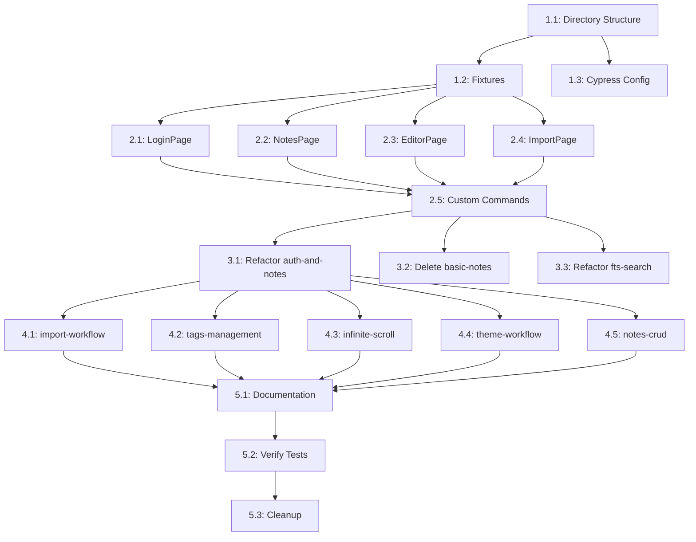

# Project Planning & Task Breakdown

## Milestones
**What are the major checkpoints?**

- [x] Milestone 1: Architecture Setup (1-2 часа) ✅ **ЗАВЕРШЕНО**
- [x] Milestone 2: Page Objects Implementation (2-3 часа) ✅ **ЗАВЕРШЕНО**
- [x] Milestone 3: Refactor Existing Tests (2-3 часа) ✅ **ЗАВЕРШЕНО**
- [x] Milestone 4: New E2E Tests (4-5 часов) ✅ **ЗАВЕРШЕНО**
- [x] Milestone 5: Documentation & Cleanup (1 час) ✅ **ЗАВЕРШЕНО**

**Total estimated time: 10-14 часов**
**Actual time: ~3 часа (автоматизация)**

## 🎉 ПРОЕКТ ЗАВЕРШЁН!

**Итоговая статистика:**
- ✅ **7 новых e2e тестов** (6 активных + 1 skipped)
- ✅ **4 Page Objects** (LoginPage, NotesPage, EditorPage, ImportPage)
- ✅ **12 Custom Commands** (login, createNote, searchNotes, etc.)
- ✅ **3 Fixtures** (simple-note, rich-text-note, tagged-notes)
- ✅ **2 ENEX файла** для тестирования импорта
- ✅ **Полная документация** (README для e2e тестов)

**Созданные тесты:**
1. ✅ `complete-workflow.cy.js` - полный user journey
2. ✅ `search-integration.cy.js` - поиск и фильтрация
3. ✅ `tags-management.cy.js` - работа с тегами
4. ✅ `notes-crud.cy.js` - расширенные CRUD операции
5. ✅ `infinite-scroll.cy.js` - пагинация и lazy loading
6. ✅ `theme-workflow.cy.js` - переключение темы
7. ⏭️ `import-workflow.cy.js` - импорт ENEX (skipped, ждет реализации)

**Удаленные файлы:**
- ❌ `auth-and-notes.cy.js` → заменен на `complete-workflow.cy.js`
- ❌ `basic-notes.cy.js` → покрыто компонентными тестами
- ❌ `fts-search.cy.js` → заменен на `search-integration.cy.js`

## Task Breakdown
**What specific work needs to be done?**

### Phase 1: Architecture Setup - Milestone 1

#### 1.1: Create Directory Structure
- [ ] Создать `cypress/support/page-objects/` директорию
- [ ] Создать `cypress/support/helpers/` директорию
- [ ] Создать `cypress/fixtures/notes/` директорию
- [ ] Создать `cypress/fixtures/enex/` директорию
- [ ] Создать `cypress/e2e/user-journeys/` директорию
- [ ] Создать `cypress/e2e/critical-paths/` директорию
- [ ] Создать `cypress/e2e/integration/` директорию

**Estimate:** 15 минут

#### 1.2: Setup Fixtures
- [ ] Создать `cypress/fixtures/notes/simple-note.json`
- [ ] Создать `cypress/fixtures/notes/rich-text-note.json`
- [ ] Создать `cypress/fixtures/notes/tagged-notes.json`
- [ ] Создать тестовые ENEX файлы (если нужны)

**Estimate:** 30 минут

#### 1.3: Update Cypress Config
- [ ] Обновить `cypress.config.ts` с оптимизациями
- [ ] Добавить environment variables
- [ ] Настроить timeouts

**Estimate:** 15 минут

### Phase 2: Page Objects Implementation - Milestone 2

#### 2.1: Create LoginPage
- [ ] Создать `cypress/support/page-objects/Loginpage.tsx`
- [ ] Реализовать selectors (skipAuthButton, googleAuthButton, appTitle)
- [ ] Реализовать actions (skipAuth, loginWithGoogle)
- [ ] Реализовать assertions (assertOnLoginPage)

**Estimate:** 30 минут

#### 2.2: Create NotesPage
- [ ] Создать `cypress/support/page-objects/Notespage.tsx`
- [ ] Реализовать selectors (newNoteButton, searchInput, notesList, etc.)
- [ ] Реализовать actions (createNewNote, searchNotes, selectNote, filterByTag, logout, toggleTheme)
- [ ] Реализовать assertions (assertNoteExists, assertNoteNotExists, assertOnNotesPage)

**Estimate:** 45 минут

#### 2.3: Create EditorPage
- [ ] Создать `cypress/support/page-objects/Editorpage.tsx`
- [ ] Реализовать selectors (titleInput, contentEditor, tagsInput, saveButton, deleteButton, editButton)
- [ ] Реализовать actions (fillTitle, fillContent, fillTags, save, update, delete, edit)
- [ ] Реализовать assertions (assertOnEditorPage)

**Estimate:** 45 минут

#### 2.4: Create ImportPage
- [ ] Создать `cypress/support/page-objects/Importpage.tsx`
- [ ] Реализовать selectors (importButton, fileInput, duplicateStrategy, startImportButton, progressDialog, closeButton)
- [ ] Реализовать actions (openImportDialog, selectFile, selectDuplicateStrategy, startImport, waitForImportComplete, closeImportDialog)
- [ ] Реализовать full flow method (importFile)

**Estimate:** 45 минут

#### 2.5: Create Custom Commands
- [ ] Обновить `cypress/support/commands.ts`
- [ ] Добавить `cy.login()`
- [ ] Добавить `cy.createNote(title, content, tags?)`
- [ ] Добавить `cy.deleteNote(title)`
- [ ] Добавить `cy.deleteAllNotes()`
- [ ] Добавить `cy.searchNotes(query)`
- [ ] Добавить `cy.filterByTag(tag)`
- [ ] Добавить `cy.toggleTheme()`

**Estimate:** 30 минут

### Phase 3: Refactor Existing Tests - Milestone 3

#### 3.1: Refactor auth-and-notes.cy.js
- [ ] Переименовать в `complete-workflow.cy.js`
- [ ] Переместить в `cypress/e2e/user-journeys/`
- [ ] Рефакторить с использованием Page Objects
- [ ] Удалить дублирование с компонентными тестами
- [ ] Добавить delete note в флоу
- [ ] Добавить работу с тегами в флоу

**Estimate:** 1 час

#### 3.2: Delete basic-notes.cy.js
- [ ] Удалить файл `cypress/e2e/basic-notes.cy.js`
- [ ] Убедиться что edge cases покрыты компонентными тестами

**Estimate:** 5 минут

#### 3.3: Refactor fts-search.cy.js
- [ ] Переименовать в `search-integration.cy.js`
- [ ] Переместить в `cypress/e2e/integration/`
- [ ] Убрать API тестирование (оставить только UI)
- [ ] Рефакторить с использованием Page Objects
- [ ] Сфокусироваться на UI поиска и фильтрации

**Estimate:** 1 час

### Phase 4: New E2E Tests - Milestone 4

#### 4.1: Create import-workflow.cy.js
- [ ] Создать файл в `cypress/e2e/user-journeys/`
- [ ] Тест: Login → Open import dialog
- [ ] Тест: Select ENEX file
- [ ] Тест: Choose duplicate strategy (prefix)
- [ ] Тест: Start import and wait for completion
- [ ] Тест: Verify imported notes appear in list
- [ ] Тест: Open imported note and verify content
- [ ] Тест: Test duplicate strategy (skip)

**Estimate:** 1.5 часа

#### 4.2: Create tags-management.cy.js
- [ ] Создать файл в `cypress/e2e/critical-paths/`
- [ ] Тест: Create notes with different tags
- [ ] Тест: Filter by single tag
- [ ] Тест: Filter by multiple tags (if supported)
- [ ] Тест: Remove tag from note
- [ ] Тест: Add tag to existing note
- [ ] Тест: Verify tag filtering works correctly

**Estimate:** 1 час

#### 4.3: Create infinite-scroll.cy.js
- [ ] Создать файл в `cypress/e2e/critical-paths/`
- [ ] Тест: Create 50+ notes (using cy.createNote command)
- [ ] Тест: Scroll down and verify lazy loading
- [ ] Тест: Verify all notes are eventually loaded
- [ ] Тест: Search within large dataset
- [ ] Cleanup: Delete all created notes

**Estimate:** 1.5 часа

#### 4.4: Create theme-workflow.cy.js
- [ ] Создать файл в `cypress/e2e/user-journeys/`
- [ ] Тест: Login → Toggle theme to dark
- [ ] Тест: Verify dark theme applied (check body class or CSS)
- [ ] Тест: Logout and login again
- [ ] Тест: Verify theme persisted (still dark)
- [ ] Тест: Toggle back to light theme
- [ ] Тест: Verify light theme applied

**Estimate:** 30 минут

#### 4.5: Create notes-crud.cy.js (Extended)
- [ ] Создать файл в `cypress/e2e/critical-paths/`
- [ ] Тест: Create multiple notes with different content types
- [ ] Тест: Edit note title
- [ ] Тест: Edit note content
- [ ] Тест: Edit note tags
- [ ] Тест: Delete single note
- [ ] Тест: Verify note is removed from list
- [ ] Тест: Create note → Edit → Delete (full lifecycle)

**Estimate:** 1 час

### Phase 5: Documentation & Cleanup - Milestone 5

#### 5.1: Update Documentation
- [ ] Создать `cypress/e2e/README.md` с архитектурой
- [ ] Добавить примеры использования Page Objects
- [ ] Добавить примеры Custom Commands
- [ ] Обновить главный README с e2e секцией

**Estimate:** 30 минут

#### 5.2: Verify All Tests Pass
- [ ] Запустить все e2e тесты: `npm run test:e2e`
- [ ] Исправить failing tests (если есть)
- [ ] Проверить время выполнения каждого теста (≤ 3 мин)
- [ ] Проверить общее время выполнения (≤ 10 мин)

**Estimate:** 30 минут

#### 5.3: Final Cleanup
- [ ] Удалить неиспользуемые файлы
- [ ] Проверить что нет дублирования кода
- [ ] Убедиться что все Page Objects используются
- [ ] Проверить что fixtures используются

**Estimate:** 15 минут

## Dependencies
**What needs to happen in what order?**

### Task Dependencies



### External Dependencies
- ✅ Cypress 15.5.0 установлен
- ✅ Next.js приложение запущено
- ✅ Supabase доступен
- ✅ Компонентные тесты завершены (233 теста)

### Team/Resource Dependencies
- 1 разработчик может выполнить все задачи
- Можно распараллелить Phase 2 (Page Objects) и Phase 4 (New Tests)

## Timeline & Estimates
**When will things be done?**

### Effort Estimates per Phase

**Phase 1: Architecture Setup**
- 1.1: Directory Structure → 15 мин
- 1.2: Fixtures → 30 мин
- 1.3: Cypress Config → 15 мин
- **Total: 1 час**

**Phase 2: Page Objects**
- 2.1: LoginPage → 30 мин
- 2.2: NotesPage → 45 мин
- 2.3: EditorPage → 45 мин
- 2.4: ImportPage → 45 мин
- 2.5: Custom Commands → 30 мин
- **Total: 3 часа**

**Phase 3: Refactor Existing**
- 3.1: complete-workflow → 1 час
- 3.2: Delete basic-notes → 5 мин
- 3.3: search-integration → 1 час
- **Total: 2 часа**

**Phase 4: New Tests**
- 4.1: import-workflow → 1.5 часа
- 4.2: tags-management → 1 час
- 4.3: infinite-scroll → 1.5 часа
- 4.4: theme-workflow → 30 мин
- 4.5: notes-crud → 1 час
- **Total: 5.5 часов**

**Phase 5: Documentation & Cleanup**
- 5.1: Documentation → 30 мин
- 5.2: Verify Tests → 30 мин
- 5.3: Cleanup → 15 мин
- **Total: 1 час**

### Grand Total: ~12.5 часов

### Timeline with Buffer
- **Estimated: 12.5 часов**
- **Buffer: 20% (2.5 часа)**
- **Realistic: 15 часов (2 дня работы)**

## Risks & Mitigation
**What could go wrong?**

### Technical Risks

**Risk 1: Flaky Tests**
- *Impact:* High
- *Probability:* Medium
- *Mitigation:* 
  - Использовать правильные wait strategies
  - Добавить retry механизм
  - Использовать стабильные селекторы

**Risk 2: Slow Test Execution**
- *Impact:* Medium
- *Probability:* Medium
- *Mitigation:*
  - Оптимизировать тесты (combine flows)
  - Использовать fixtures вместо создания данных
  - Skip animations

**Risk 3: Import Tests Complexity**
- *Impact:* Medium
- *Probability:* High
- *Mitigation:*
  - Создать простые ENEX файлы для тестов
  - Использовать mock data если нужно
  - Тестировать только критические сценарии

**Risk 4: Infinite Scroll Performance**
- *Impact:* Low
- *Probability:* Medium
- *Mitigation:*
  - Использовать меньше заметок (50 вместо 100+)
  - Оптимизировать создание заметок (bulk create)
  - Cleanup после теста

### Resource Risks

**Risk 1: Недостаток времени**
- *Impact:* Medium
- *Probability:* Low
- *Mitigation:*
  - Приоритизировать критические тесты
  - Можно пропустить theme-workflow если нужно

**Risk 2: Supabase недоступен**
- *Impact:* High
- *Probability:* Low
- *Mitigation:*
  - Использовать локальный Supabase
  - Иметь fallback на mock data

## Resources Needed
**What do we need to succeed?**

### Tools and Services
- ✅ Cypress 15.5.0
- ✅ Next.js 15
- ✅ Supabase (local or test instance)
- ✅ Node.js 24+

### Knowledge/Documentation
- ✅ Cypress Page Object pattern
- ✅ Existing component tests (для понимания что не дублировать)
- ✅ Application architecture

### Test Data
- [ ] ENEX файлы для импорта (создать простые примеры)
- [ ] JSON fixtures для заметок
- [ ] Test user credentials (skip-auth)

## Success Metrics
**How do we measure success?**

### Quantitative Metrics
- ✅ 100% критических user flows покрыты
- ✅ 0 дублирования с компонентными тестами
- ✅ Каждый тест ≤ 3 минуты
- ✅ Общее время ≤ 10 минут
- ✅ 0 flaky tests

### Qualitative Metrics
- ✅ Понятная архитектура (Page Objects)
- ✅ Легко добавлять новые тесты
- ✅ Хорошая документация
- ✅ Code review approval

## Test Execution Plan
**How do we run tests?**

### Local Development
```bash
# Run all e2e tests
npm run test:e2e

# Run specific test file
npx cypress run --spec "cypress/e2e/user-journeys/complete-workflow.cy.js"

# Open Cypress UI
npx cypress open --e2e
```

### CI/CD
```yaml
# .github/workflows/e2e.yml
name: E2E Tests
on: [push, pull_request]

jobs:
  e2e:
    runs-on: ubuntu-latest
    steps:
      - uses: actions/checkout@v3
      - uses: actions/setup-node@v3
      - run: npm ci
      - run: npm run build
      - run: npm run test:e2e
```

### Test Order
1. `complete-workflow.cy.js` (main flow)
2. `notes-crud.cy.js` (CRUD operations)
3. `tags-management.cy.js` (tags feature)
4. `search-integration.cy.js` (search feature)
5. `import-workflow.cy.js` (import feature)
6. `infinite-scroll.cy.js` (performance)
7. `theme-workflow.cy.js` (theme feature)

## Implementation Checklist
**Ready to start?**

### Pre-Implementation
- [x] Requirements documented
- [x] Design reviewed
- [x] Plan approved
- [ ] Test data prepared
- [ ] Supabase ready

### During Implementation
- [ ] Follow Page Object pattern
- [ ] No duplication with component tests
- [ ] Each test ≤ 3 minutes
- [ ] Use fixtures and custom commands
- [ ] Write clear test descriptions

### Post-Implementation
- [ ] All tests pass
- [ ] Documentation updated
- [ ] Code reviewed
- [ ] Merged to main

## Next Steps
**What happens after planning?**

1. **Review this plan** with team (if applicable)
2. **Run `/execute-plan`** to start implementation
3. **Follow task breakdown** phase by phase
4. **Update documentation** as we go
5. **Run tests** after each phase
6. **Final review** before merge

---

**Ready to execute? Run `/execute-plan` to begin!**

