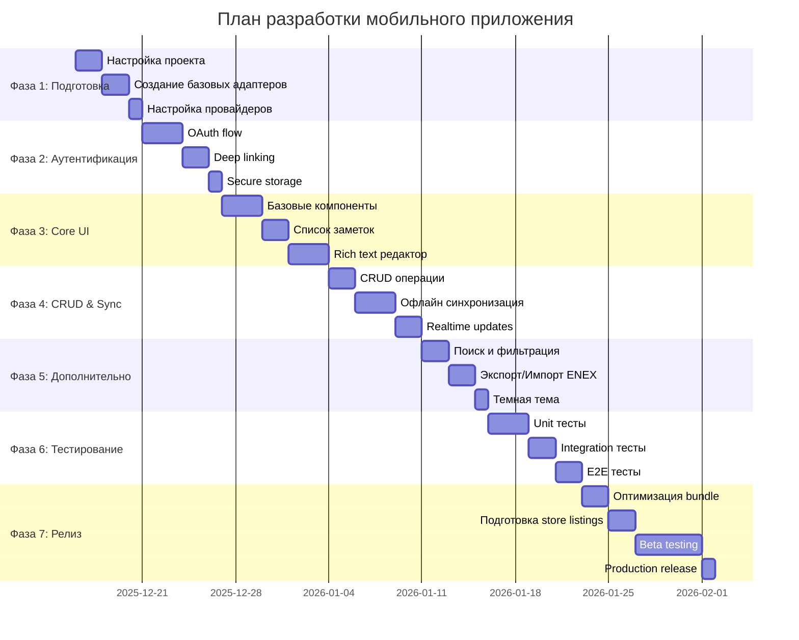

# План реализации мобильного приложения

## Обзор

**Цель:** Создать нативное мобильное приложение для iOS и Android с максимальным переиспользованием core-слоя

**Общая оценка времени:** 4-6 недель (1 разработчик)

**Приоритет:** MVP сначала, потом оптимизации и дополнительные фичи

## Фазы разработки



## Фаза 1: Подготовка инфраструктуры (5 дней)

### Задача 1.1: Инициализация Expo проекта
**Приоритет:** Критический  
**Оценка:** 4 часа  
**Статус:** Не начата

**Шаги:**
1. Создать новый Expo проект с TypeScript
   ```bash
   npx create-expo-app mobile --template
   cd mobile
   ```

2. Настроить `app.json`
   ```json
   {
     "expo": {
       "name": "EverFreeNote",
       "slug": "everfreenote",
       "scheme": "everfreenote",
       "version": "0.1.0",
       "orientation": "portrait",
       "icon": "./assets/icon.png",
       "splash": {
         "image": "./assets/splash.png",
         "resizeMode": "contain",
         "backgroundColor": "#ffffff"
       },
       "ios": {
         "bundleIdentifier": "com.everfreenote.app",
         "supportsTablet": false,
         "infoPlist": {
           "UIBackgroundModes": ["remote-notification"]
         }
       },
       "android": {
         "package": "com.everfreenote.app",
         "adaptiveIcon": {
           "foregroundImage": "./assets/adaptive-icon.png",
           "backgroundColor": "#ffffff"
         },
         "permissions": [
           "android.permission.INTERNET",
           "android.permission.ACCESS_NETWORK_STATE"
         ]
       },
       "plugins": [
         "expo-router",
         "expo-secure-store",
         "expo-web-browser"
       ]
     }
   }
   ```

3. Установить зависимости
   ```bash
   # Core dependencies
   npm install expo-router expo-web-browser expo-linking expo-secure-store
   npm install @react-native-async-storage/async-storage
   npm install expo-sqlite
   npm install @tanstack/react-query
   npm install @supabase/supabase-js
   
   # UI dependencies
   npm install nativewind
   npm install tailwindcss
   npm install lucide-react-native
   npm install @10play/tentap-editor
   npm install @shopify/flash-list
   npm install react-native-reanimated
   npm install react-native-gesture-handler
   
   # Network & offline
   npm install @react-native-community/netinfo
   
   # Dev dependencies
   npm install --save-dev @types/react @types/react-native
   ```

4. Настроить TypeScript paths для доступа к core
   ```json
   // tsconfig.json
   {
     "extends": "expo/tsconfig.base",
     "compilerOptions": {
       "strict": true,
       "baseUrl": ".",
       "paths": {
         "@/*": ["./*"],
         "@core/*": ["../core/*"],
         "@ui/mobile/*": ["./components/*"]
       }
     }
   }
   ```

**Критерии приемки:**
- ✅ Проект успешно инициализирован
- ✅ Все зависимости установлены
- ✅ TypeScript настроен с paths для core
- ✅ `npm run start` запускается без ошибок

---

### Задача 1.2: Настройка Expo Router
**Приоритет:** Критический  
**Оценка:** 3 часа  
**Статус:** Не начата

**Шаги:**
1. Создать структуру папок
   ```
   mobile/
   ├── app/
   │   ├── (auth)/
   │   │   ├── _layout.tsx
   │   │   ├── login.tsx
   │   │   └── callback.tsx
   │   ├── (tabs)/
   │   │   ├── _layout.tsx
   │   │   ├── index.tsx
   │   │   ├── search.tsx
   │   │   └── profile.tsx
   │   ├── note/
   │   │   └── [id].tsx
   │   ├── _layout.tsx
   │   └── +not-found.tsx
   ```

2. Реализовать Root Layout
   ```typescript
   // app/_layout.tsx
   import { Slot } from 'expo-router'
   import { SupabaseProvider } from '@/providers/SupabaseProvider'
   import { QueryProvider } from '@/providers/QueryProvider'
   
   export default function RootLayout() {
     return (
       <SupabaseProvider>
         <QueryProvider>
           <Slot />
         </QueryProvider>
       </SupabaseProvider>
     )
   }
   ```

3. Настроить navigation guard для защищенных роутов
   ```typescript
   // app/(tabs)/_layout.tsx
   import { Redirect, Tabs } from 'expo-router'
   import { useAuth } from '@/hooks/useAuth'
   
   export default function TabsLayout() {
     const { user, loading } = useAuth()
     
     if (loading) return <LoadingScreen />
     if (!user) return <Redirect href="/(auth)/login" />
     
     return <Tabs>{/* ... */}</Tabs>
   }
   ```

**Критерии приемки:**
- ✅ File-based routing работает
- ✅ Navigation guard защищает приватные роуты
- ✅ Переходы между экранами работают

---

### Задача 1.3: Создание адаптеров
**Приоритет:** Критический  
**Оценка:** 6 часов  
**Статус:** Не начата

**Подзадачи:**

#### 1.3.1: Storage Adapter (AsyncStorage)
```typescript
// mobile/adapters/storage.ts
import AsyncStorage from '@react-native-async-storage/async-storage'
import type { StorageAdapter } from '@core/adapters/storage'

export const mobileStorageAdapter: StorageAdapter = {
  async getItem(key: string) {
    try {
      return await AsyncStorage.getItem(key)
    } catch (error) {
      console.error('[Storage] getItem error:', error)
      return null
    }
  },
  
  async setItem(key: string, value: string) {
    try {
      await AsyncStorage.setItem(key, value)
    } catch (error) {
      console.error('[Storage] setItem error:', error)
      if (error.message?.includes('quota')) {
        // Очистка старых данных при переполнении
        await this.clearOldCache()
        await AsyncStorage.setItem(key, value)
      }
    }
  },
  
  async removeItem(key: string) {
    await AsyncStorage.removeItem(key)
  },
  
  async clearOldCache() {
    // Очистка кэша старее 7 дней
    const keys = await AsyncStorage.getAllKeys()
    const cacheKeys = keys.filter(k => k.startsWith('cache:'))
    
    for (const key of cacheKeys) {
      const item = await AsyncStorage.getItem(key)
      if (item) {
        const { timestamp } = JSON.parse(item)
        const age = Date.now() - timestamp
        if (age > 7 * 24 * 60 * 60 * 1000) {
          await AsyncStorage.removeItem(key)
        }
      }
    }
  },
}
```

#### 1.3.2: OAuth Adapter (Expo WebBrowser)
```typescript
// mobile/adapters/oauth.ts
import * as WebBrowser from 'expo-web-browser'
import * as Linking from 'expo-linking'
import type { OAuthAdapter } from '@core/adapters/oauth'

WebBrowser.maybeCompleteAuthSession()

export const mobileOAuthAdapter: OAuthAdapter = {
  async startOAuth(authUrl: string) {
    const redirectUrl = Linking.createURL('auth/callback')
    
    const result = await WebBrowser.openAuthSessionAsync(
      authUrl,
      redirectUrl,
      { preferEphemeralSession: true }
    )
    
    if (result.type === 'success') {
      return result.url
    } else if (result.type === 'cancel') {
      throw new Error('OAuth cancelled by user')
    } else {
      throw new Error('OAuth failed')
    }
  },
}
```

#### 1.3.3: Navigation Adapter (Expo Router)
```typescript
// mobile/adapters/navigation.ts
import { router } from 'expo-router'
import type { NavigationAdapter } from '@core/adapters/navigation'

export const mobileNavigationAdapter: NavigationAdapter = {
  navigate(url: string, options?: { replace?: boolean }) {
    if (options?.replace) {
      router.replace(url)
    } else {
      router.push(url)
    }
  },
}
```

#### 1.3.4: Supabase Client
```typescript
// mobile/adapters/supabaseClient.ts
import { createClient } from '@supabase/supabase-js'
import { mobileStorageAdapter } from './storage'

const supabaseUrl = process.env.EXPO_PUBLIC_SUPABASE_URL!
const supabaseAnonKey = process.env.EXPO_PUBLIC_SUPABASE_ANON_KEY!

export const supabase = createClient(supabaseUrl, supabaseAnonKey, {
  auth: {
    storage: mobileStorageAdapter,
    autoRefreshToken: true,
    persistSession: true,
    detectSessionInUrl: false,
  },
})
```

**Критерии приемки:**
- ✅ Все адаптеры реализованы
- ✅ Storage adapter корректно сохраняет/читает данные
- ✅ OAuth adapter открывает браузер и получает callback
- ✅ Navigation adapter переключает экраны
- ✅ Supabase client инициализируется с mobile storage

---

### Задача 1.4: Настройка провайдеров
**Приоритет:** Высокий  
**Оценка:** 2 часа  
**Статус:** Не начата

```typescript
// mobile/providers/SupabaseProvider.tsx
import { createContext, useContext, useState, useEffect } from 'react'
import { supabase } from '@/adapters/supabaseClient'
import type { User } from '@supabase/supabase-js'

type SupabaseContextType = {
  user: User | null
  loading: boolean
}

const SupabaseContext = createContext<SupabaseContextType>({
  user: null,
  loading: true,
})

export const SupabaseProvider = ({ children }) => {
  const [user, setUser] = useState<User | null>(null)
  const [loading, setLoading] = useState(true)
  
  useEffect(() => {
    // Получаем текущую сессию
    supabase.auth.getSession().then(({ data: { session } }) => {
      setUser(session?.user ?? null)
      setLoading(false)
    })
    
    // Слушаем изменения auth
    const { data: { subscription } } = supabase.auth.onAuthStateChange(
      (_event, session) => {
        setUser(session?.user ?? null)
      }
    )
    
    return () => subscription.unsubscribe()
  }, [])
  
  return (
    <SupabaseContext.Provider value={{ user, loading }}>
      {children}
    </SupabaseContext.Provider>
  )
}

export const useSupabase = () => useContext(SupabaseContext)
```

**Критерии приемки:**
- ✅ SupabaseProvider инициализируется
- ✅ QueryProvider настроен
- ✅ ThemeProvider работает

---

## Фаза 2: Аутентификация (6 дней)

### Задача 2.1: OAuth через Google
**Приоритет:** Критический  
**Оценка:** 8 часов  
**Статус:** Не начата

**Шаги:**
1. Создать login экран
2. Реализовать OAuth flow
3. Обработать callback
4. Сохранить токены в SecureStore

**Файлы:**
- `app/(auth)/login.tsx`
- `app/(auth)/callback.tsx`
- `hooks/useAuth.ts`

**Критерии приемки:**
- ✅ Кнопка "Войти через Google" работает
- ✅ После успешного входа редирект на главный экран
- ✅ Токены сохраняются в SecureStore
- ✅ При перезапуске приложения пользователь остается залогинен

---

### Задача 2.2: Deep Linking
**Приоритет:** Критический  
**Оценка:** 6 часов  
**Статус:** Не начата

**Шаги:**
1. Настроить схему `everfreenote://`
2. Зарегистрировать в app.json
3. Обработать callback URL
4. Добавить в Supabase redirect URL

**Критерии приемки:**
- ✅ Deep link `everfreenote://auth/callback` работает
- ✅ OAuth редирект корректно обрабатывается
- ✅ В production работает universal links

---

## Фаза 3: Core UI Components (8 дней)

### Задача 3.1: Базовые UI компоненты
**Приоритет:** Высокий  
**Оценка:** 8 часов  
**Статус:** Не начата

**Компоненты для создания:**
- Button
- Input
- Card
- Badge (для тегов)
- Loading spinner
- Empty state

**Пример:**
```typescript
// components/ui/Button.tsx
import { Pressable, Text } from 'react-native'
import { styled } from 'nativewind'

const StyledPressable = styled(Pressable)
const StyledText = styled(Text)

export const Button = ({ variant = 'default', onPress, children }) => (
  <StyledPressable
    onPress={onPress}
    className={`rounded-lg px-4 py-3 ${
      variant === 'default' ? 'bg-primary' : 'bg-transparent border'
    }`}
  >
    <StyledText className="text-white font-medium text-center">
      {children}
    </StyledText>
  </StyledPressable>
)
```

**Критерии приемки:**
- ✅ Все компоненты созданы
- ✅ Стилизация через NativeWind работает
- ✅ Компоненты переиспользуемые

---

### Задача 3.2: Список заметок (виртуализация)
**Приоритет:** Критический  
**Оценка:** 6 часов  
**Статус:** Не начата

```typescript
// components/NoteList.tsx
import { FlashList } from '@shopify/flash-list'
import { NoteCard } from './NoteCard'
import type { Note } from '@core/types/domain'

type NoteListProps = {
  notes: Note[]
  onNotePress: (note: Note) => void
  onTagPress: (tag: string) => void
}

export const NoteList = ({ notes, onNotePress, onTagPress }: NoteListProps) => {
  return (
    <FlashList
      data={notes}
      renderItem={({ item }) => (
        <NoteCard
          note={item}
          onPress={() => onNotePress(item)}
          onTagPress={onTagPress}
        />
      )}
      estimatedItemSize={120}
      keyExtractor={(item) => item.id}
    />
  )
}
```

**Критерии приемки:**
- ✅ FlashList рендерит список
- ✅ Скролл плавный (60 FPS)
- ✅ NoteCard отображает заметку корректно

---

### Задача 3.3: Rich Text Editor
**Приоритет:** Критический  
**Оценка:** 10 часов  
**Статус:** Не начата

**Решение:** @10play/tentap-editor (современный редактор на базе TipTap)

```typescript
// components/RichTextEditor.tsx
import { RichText, Toolbar, useEditorBridge } from '@10play/tentap-editor'

export const RichTextEditor = forwardRef<RichTextEditorHandle, Props>(
  ({ initialContent, onContentChange }, ref) => {
    const editor = useEditorBridge({
      autofocus: true,
      avoidIosKeyboard: true,
      initialContent,
      onChange: onContentChange,
    })
    
    useImperativeHandle(ref, () => ({
      async getHTML() {
        return await editor.getHTML()
      },
      setContent(html: string) {
        editor.setContent(html)
      },
    }))
    
    return (
      <>
        <Toolbar editor={editor} />
        <RichText editor={editor} />
      </>
    )
  }
)
```

**Критерии приемки:**
- ✅ Редактор отображается
- ✅ Форматирование работает (bold, italic, headings, lists)
- ✅ Автосохранение работает
- ✅ Клавиатура не перекрывает контент
- ✅ API схож с TipTap из web-версии

---

## Фаза 4: CRUD & Sync (7 дней)

### Задача 4.1: CRUD операции с заметками
**Приоритет:** Критический  
**Оценка:** 6 часов  
**Статус:** Не начата

**Использовать существующий NoteService из core:**

```typescript
// hooks/useNotes.ts
import { useQuery, useMutation, useQueryClient } from '@tanstack/react-query'
import { NoteService } from '@core/services/notes'
import { supabase } from '@/adapters/supabaseClient'

const noteService = new NoteService(supabase)

export const useNotes = (userId: string) => {
  const queryClient = useQueryClient()
  
  const { data, isLoading } = useQuery({
    queryKey: ['notes', userId],
    queryFn: () => noteService.getNotes(userId),
  })
  
  const createMutation = useMutation({
    mutationFn: (note) => noteService.createNote({ ...note, userId }),
    onSuccess: () => {
      queryClient.invalidateQueries({ queryKey: ['notes', userId] })
    },
  })
  
  return {
    notes: data?.notes || [],
    isLoading,
    createNote: createMutation.mutate,
  }
}
```

**Критерии приемки:**
- ✅ Создание заметки работает
- ✅ Редактирование заметки работает
- ✅ Удаление заметки работает
- ✅ TanStack Query кэширует данные

---

### Задача 4.2: Офлайн синхронизация
**Приоритет:** Высокий  
**Оценка:** 10 часов  
**Статус:** Не начата

**Использовать offlineSyncManager из core:**

```typescript
// hooks/useOfflineSync.ts
import { useEffect } from 'react'
import { AppState } from 'react-native'
import NetInfo from '@react-native-community/netinfo'
import { offlineSyncManager } from '@core/services/offlineSyncManager'

export const useOfflineSync = () => {
  useEffect(() => {
    // Слушаем изменения сети
    const unsubscribe = NetInfo.addEventListener((state) => {
      if (state.isConnected) {
        offlineSyncManager.processQueue()
      }
    })
    
    // Слушаем app state
    const subscription = AppState.addEventListener('change', (nextAppState) => {
      if (nextAppState === 'active') {
        offlineSyncManager.processQueue()
      }
    })
    
    return () => {
      unsubscribe()
      subscription.remove()
    }
  }, [])
}
```

**Критерии приемки:**
- ✅ Офлайн создание заметки добавляется в очередь
- ✅ При появлении интернета очередь обрабатывается
- ✅ Конфликты разрешаются корректно

---

## Фаза 5: Дополнительные фичи (5 дней)

### Задача 5.1: Поиск и фильтрация
**Приоритет:** Средний  
**Оценка:** 6 часов  

**Использовать SearchService из core**

---

### Задача 5.2: Экспорт/Импорт ENEX
**Приоритет:** Низкий  
**Оценка:** 6 часов  

**Использовать ENEX сервисы из core + expo-file-system**

---

## Фаза 6: Тестирование (7 дней)

### Задача 6.1: Unit тесты
**Оценка:** 10 часов  

**Покрытие:**
- Компоненты: 80%
- Hooks: 90%
- Utils: 100%

```typescript
// components/__tests__/Button.test.tsx
import { render, fireEvent } from '@testing-library/react-native'
import { Button } from '../ui/Button'

describe('Button', () => {
  it('вызывает onPress при нажатии', () => {
    const onPress = jest.fn()
    const { getByText } = render(<Button onPress={onPress}>Test</Button>)
    fireEvent.press(getByText('Test'))
    expect(onPress).toHaveBeenCalled()
  })
})
```

---

## Фаза 7: Релиз (10 дней)

### Задача 7.1: Оптимизация bundle
- Tree shaking
- Code splitting
- Hermes engine

### Задача 7.2: Beta testing
- TestFlight (iOS)
- Internal Testing (Android)

### Задача 7.3: Production release
- App Store submission
- Google Play submission

---

## Риски и зависимости

| Риск | Вероятность | Влияние | План митигации |
|------|-------------|---------|----------------|
| TipTap не работает | Высокая | Критическое | Использовать react-native-pell-rich-editor |
| OAuth сложный | Средняя | Высокое | Следовать документации Supabase |
| App Store rejection | Низкая | Высокое | Следовать HIG, проверить перед submission |

---

## Метрики успеха

- ✅ 100% core-слой переиспользован
- ✅ 80%+ покрытие тестами
- ✅ Размер bundle < 50MB
- ✅ Time to Interactive < 2s
- ✅ Scroll FPS = 60

---

## Связанные документы

- [Requirements](../requirements/feature-mobile-app-react-native.md)
- [Design](../design/design-mobile-app.md)
